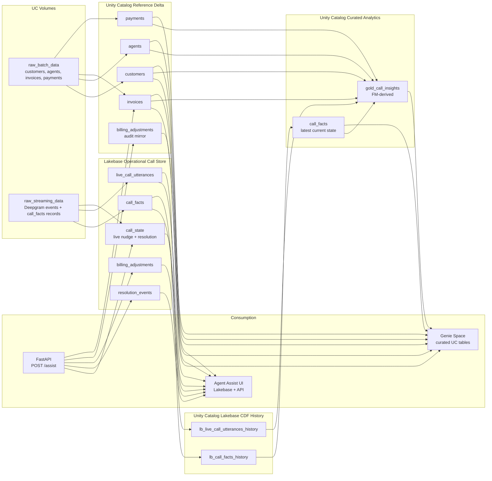
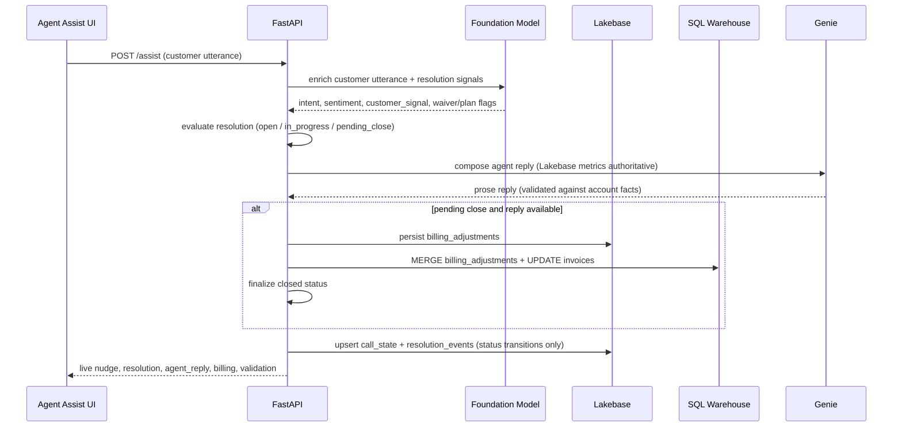
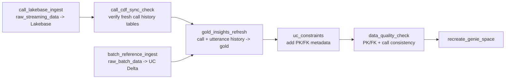

# Genie Voice Contact Center Architecture

The architecture separates enterprise reference data from live call data.

- Reference/customer/billing data is batch-ingested from `raw_batch_data` into
  governed Unity Catalog Delta tables.
- Live call data is streamed into Lakebase first for low-latency agent assist.
- Live agent-assist **resolution and billing** are written to Lakebase
  (`resolution_events`, `billing_adjustments`) and mirrored to UC for Genie.
- Lakebase CDF publishes call history into Unity Catalog.
- Job tasks build final UC `call_facts` and `gold_call_insights`.
- Genie reads curated Unity Catalog business tables plus `billing_adjustments`.

## Architecture

## Live agent assist flow

Each customer utterance on `POST /calls/{call_id}/assist` runs this pipeline.
There are no keyword fallbacks or canned agent templates.

**Ordering guarantees**

- Billing writes and `closed` status commit **after** Genie agent reply on
  customer turns, so KPIs and invoice overlays do not change while the UI still
  shows "Genie is preparing the agent response…".
- Close is blocked if billing UC/Lakebase writes fail or if Genie cannot produce
  a validated reply (`agent_reply: null`, `close_block_reason` set).
- `GET /calls/{call_id}/alignment` cross-checks resolution, active billing
  adjustments (call-scoped), and account summary.

## Job Flow

## Genie Tables

Genie reads:

- `customers`
- `agents`
- `invoices`
- `payments`
- `billing_adjustments` (live assist waiver / payment-plan writes)
- `gold_call_insights`

Genie does not read raw `lb_*_history`, `call_state`, `resolution_events`, or
raw transcript events.

## Data Quality Gate

Before Genie is recreated, `data_quality_check` validates:

- primary keys are non-null and unique
- foreign keys are not orphaned
- every call has call facts and utterances
- every call has a gold insight row
- required gold insight fields are populated
- mentioned invoices belong to the same customer as the call

## Demo reset

`POST /calls/{call_id}/reset-demo-session` reverts active billing adjustments
(UC + Lakebase), deletes `resolution_events` and live utterances for the call,
and clears resolution state in `call_state` so the spotlight scenario can be
replayed from `open`.
