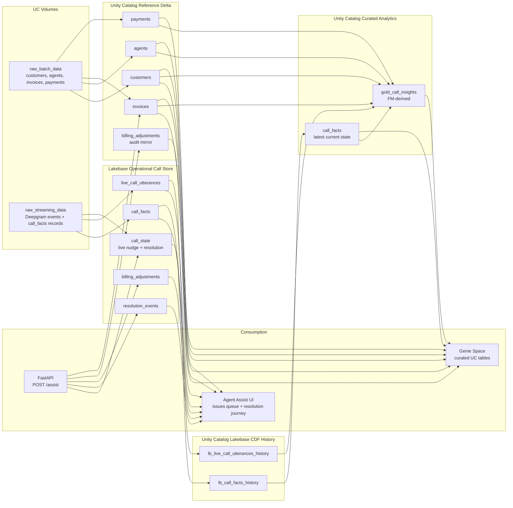
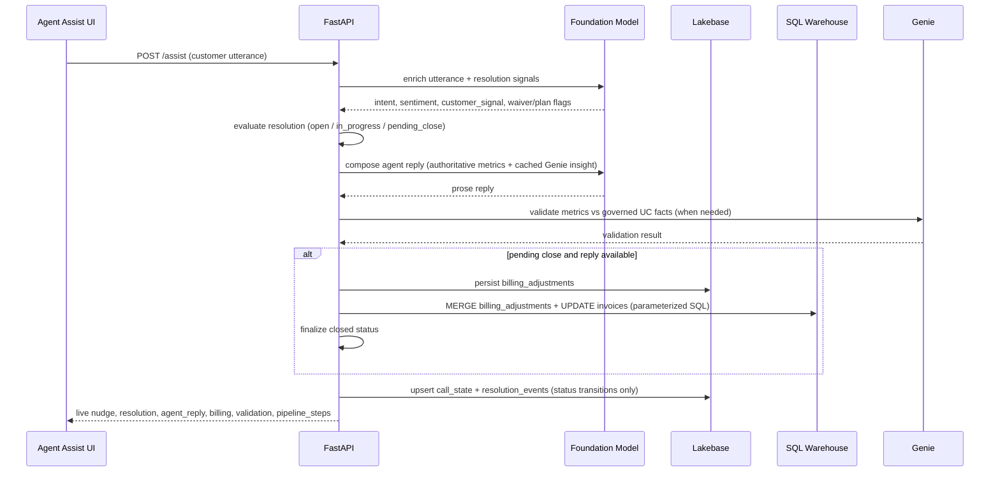
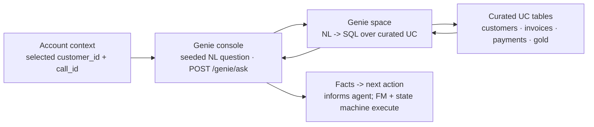
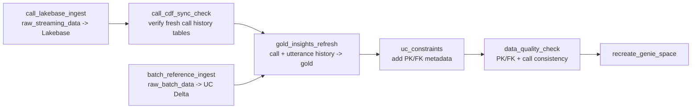

# Genie Voice Contact Center Architecture

## Problem statement: Genie for voice use cases

Contact-center voice is a **real-time** channel: the agent and customer are on the
line together. Success depends on having the right account context at the moment
of each customer utterance — not in a post-call report or a separate BI tab.

This architecture demonstrates how **Databricks Genie** fits voice workflows when
paired with **streaming capture** and **Lakebase** operational serving: governed
warehouse data powers live assist without treating every audio frame or full
transcript as an open-ended agentic chat session.

## Today's tools and gaps

| Capability | Limitation on live calls |
|---|---|
| CRM / billing UIs | Context lookup pulls the agent out of the conversation |
| Post-call transcription + summarization | Insights arrive after resolution decisions are made |
| Full-context LLM per turn | High latency, high token cost, weak audit trail |
| Genie / BI on batch gold | Strong for portfolio analytics, not millisecond assist |

**Gap:** agents lack **streaming customer context and insights during the call** —
balances, risk flags, waiver eligibility, and resolution state are not fused into
the live assist surface at utterance boundaries.

## Proposed approach: streaming, Genie, and Lakebase

The architecture separates enterprise reference data from live call data and
assigns each layer a distinct job:

| Layer | Role in voice assist |
|---|---|
| **Streaming capture** | STT produces **final utterances** (Deepgram live or synthetic producer); not per-chunk LLM |
| **Lakebase** | Hot path: `call_state`, account overlay, `resolution_events`, `billing_adjustments` |
| **Foundation Model** | One structured + prose call **per customer turn** — detects intent/signals and **composes the agent reply** |
| **Genie** | Governed NL→SQL over curated UC tables — pre-fetched account insight (off critical path), fact validation, portfolio Q&A |
| **Unity Catalog** | Batch reference, CDF history, `gold_call_insights`, DQ gate, Genie space |

- Reference/customer/billing data is batch-ingested from `raw_batch_data` into
  governed Unity Catalog Delta tables.
- Live call data is streamed into Lakebase first for low-latency agent assist.
- Live agent-assist **resolution and billing** are written to Lakebase
  (`resolution_events`, `billing_adjustments`) and mirrored to UC for Genie.
- Lakebase CDF publishes call history into Unity Catalog.
- Job tasks build final UC `call_facts` and `gold_call_insights`.
- Genie reads curated Unity Catalog business tables plus `billing_adjustments`.
- The **Foundation Model composes** the agent's spoken reply. A Genie **account
  insight** is pre-fetched when the call opens and cached in `call_state`, so the
  reply is grounded on a real Genie narrative without putting Genie's latency in
  the per-utterance path. The numbers spoken to the customer come from
  deterministic authoritative metrics, which the reply is validated against.

## Impact

1. **Streaming customer insights with Genie while the agent engages the customer**
   — each customer turn refreshes Lakebase-backed account facts, FM enrichment,
   resolution journey, and Genie-validated metrics in the Agent Assist UI.
2. **Less hold time and faster issue resolution** — customers-with-issues queue,
   pre-loaded account context, and utterance-bound resolution/billing close reduce
   dead air and repeat lookups.
3. **Avoids token-maxing for agentic solutions** — token spend scales with
   **customer turns**, not streaming audio chunks or full-history re-prompts;
   Lakebase serves state without LLM calls; Genie validates governed facts rather
   than composing every spoken response.

## System diagram

## Live agent assist flow

Each customer utterance on `POST /calls/{call_id}/assist` runs this pipeline.
There are no keyword fallbacks or canned agent templates.

**Genie account insight (off the critical path)**

- When a call is opened, the UI fires `POST /calls/{call_id}/genie-insight`. This
  asks Genie for a **single-customer NL billing snapshot** (overdue invoices,
  overdue amount, declined payments in the last 90 days, account status) and
  caches the text in `call_state`.
- The live FM reply grounds its opener on this cached narrative, so
  "Based on Genie insights, …" is **truthful** without adding Genie's
  multi-second latency to each utterance.
- If Genie returns a *clarifying question* instead of facts, it is treated as
  "no insight" and the reply falls back honestly ("Based on your account, …").
  The numbers spoken to the customer always come from deterministic authoritative
  metrics, not free-form Genie text.

**Ordering guarantees**

- Billing writes and `closed` status commit **after** the FM agent reply on
  customer turns, so KPIs and invoice overlays do not change while the UI still
  shows interim progress in the resolution journey.
- Close is blocked if billing UC/Lakebase writes fail or if the reply cannot be
  validated (`agent_reply: null`, `close_block_reason` set).
- UC billing writes use **parameterized** Statement Execution (named binds +
  `CAST`), never string interpolation — values like names with apostrophes are
  injection-safe.
- `GET /calls/{call_id}/alignment` cross-checks resolution, active billing
  adjustments (call-scoped), and account summary.

**Token economics (voice-specific)**

- **Do not** send streaming audio or rolling full transcripts to Genie per chunk.
- **Do** persist authoritative state in Lakebase and read it on UI poll/assist.
- **Do** bound FM to one call per finalized customer utterance (structured JSON +
  short prose).
- **Do** use Genie for governed analytics (`POST /genie/ask`) and metric
  validation over curated tables — amortize batch gold and UC reference across
  many calls.

## Genie console (account-scoped UC probe)

Inside the cockpit, the Genie console is **seeded with the selected customer's
account context** (`customer_id` + `call_id`) and answers from curated Unity
Catalog tables via the Genie space. It is a **decision aid** that informs the
agent's next action — it does **not** perform the resolution/billing write
itself (that is the FM + resolution state machine + parameterized write path).

## Job flow

## Genie tables

Genie reads:

- `customers`
- `agents`
- `invoices`
- `payments`
- `billing_adjustments` (live assist waiver / payment-plan writes)
- `gold_call_insights`

Genie does not read raw `lb_*_history`, `call_state`, `resolution_events`, or
raw transcript events. Live agent-facing prose is produced by the Foundation Model;
Genie remains the governed analytics and validation layer.

**Genie's runtime roles**

- **Account insight (off critical path):** `POST /calls/{call_id}/genie-insight`
  warms a single-customer NL snapshot at call open and grounds the FM reply.
- **Fact validation:** the composed reply is checked against deterministic
  authoritative metrics before close.
- **Portfolio Q&A:** `POST /genie/ask` returns Genie's NL `description`/`answer`
  (raw SQL hidden behind a toggle), suggested follow-ups as clickable chips, and
  `conversation_id` so the console can ask context-aware follow-up questions.

**Space tuning** (`genie_voice/genie/space.py`)

- The clarification rule is scoped to **aggregate** trend/volume questions only —
  it never fires on single-customer/invoice lookups or when a time window is
  already given.
- A single-customer **account-snapshot example SQL** (fan-out-safe scalar
  subqueries) anchors that query shape so account lookups answer directly instead
  of asking the user to pick a period.

## Data quality gate

Before Genie is recreated, `data_quality_check` validates:

- primary keys are non-null and unique
- foreign keys are not orphaned
- every call has call facts and utterances
- every call has a gold insight row
- required gold insight fields are populated
- mentioned invoices belong to the same customer as the call

## Demo reset

`POST /calls/{call_id}/reset-demo-session` reverts active billing adjustments
(UC + Lakebase), deletes `resolution_events` and live utterances for the call,
and clears resolution state in `call_state` so the spotlight scenario can be
replayed from `open`.
