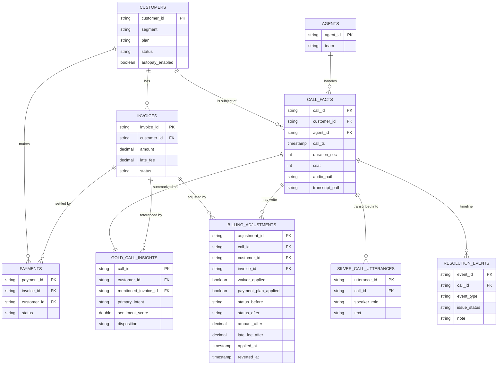

# Data model — enterprise contact-center dataset

Genie answer quality is a direct function of data quality. This dataset is
generated by `backend/genie_voice/datagen` to be **internally consistent** and
**explicitly related**, with three properties that matter most to Genie:

1. **Referential integrity** — every `call_facts` row points at a real
   `customer` and `agent`; every `invoice` and `payment` points at a real
   `customer`; every derived `gold_call_insights` row points back at a real
   `call_facts.call_id`. Nothing dangles.
2. **Declared relationships** — tables are created with informational
   `PRIMARY KEY` / `FOREIGN KEY` constraints, so Genie knows how to join them
   instead of guessing.
3. **Rich semantics** — every column has a `COMMENT`, and enum columns
   (`status`, `disposition`, `primary_intent`, …) use a small, stable vocabulary.

The conversation is generated **from** each customer's actual data state, so a
"late-fee dispute" call is always linked to an invoice that really has a late
fee, and the dollar amount spoken on the call matches the invoice amount.

## Ownership — one writer per table

Reference data and call data have different owners. Reference/customer/billing
data is batch-ingested from `raw_batch_data` into UC Delta. Live call data is
written to Lakebase first, then Lakebase CDF publishes call history into UC.

| Layer | Tables | Source of truth | Written by (UC table) |
|---|---|---|---|
| Source-system | `customers`, `agents`, `invoices`, `payments` | `raw_batch_data` reference files | `batch_reference_ingest` task |
| Telephony grain | `lb_call_facts_history` | Lakebase `call_facts` | Lakebase CDF |
| Utterance history | `lb_live_call_utterances_history` | Lakebase `live_call_utterances` | Lakebase CDF |
| Gold | `gold_call_insights` | — (from call + utterance history) | `gold_insights_refresh` task |
| Live assist (Lakebase) | `call_state`, `live_call_utterances`, `call_facts`, `resolution_events`, `billing_adjustments` | per-call session + timeline | Voice API (`POST /assist`, reset) |
| Live assist (UC) | `billing_adjustments` | audit mirror of Lakebase adjustments; updates linked `invoices` | Voice API via **SQL warehouse** |

`gold_call_insights` has a single producer of record: `gold_insights_refresh`
derives it from the transcript using the Foundation Model path (`ai_query` with structured
`json_schema` output). The demo generator writes reference data to
`raw_batch_data` and call data to `raw_streaming_data`/Lakebase; it does not write
governed UC analytics tables directly.

## Live assist resolution & billing

Issue resolution is tracked in `call_state.state.resolution` and mirrored to
`resolution_events` (one row per **status transition** only: `open` →
`in_progress` → `closed`). Duplicate timeline rows are suppressed at write time.

| Stage | Trigger (FM `customer_signal`) | Persisted when |
|---|---|---|
| `open` | initial | call created |
| `in_progress` | `request_help` + waiver/plan flags | after `POST /assist` completes |
| `closed` | `confirm_proceed` + billing success | after Genie reply + billing commit |

**Billing adjustment semantics** (`billing_adjustments` + UC `invoices` update):

- `waiver_applied` — sets `late_fee_after = 0`, reduces `amount_after` by the
  waived late fee.
- `payment_plan_applied` — customer confirmed a payment arrangement.
- `status_after` — governed invoice status after adjustment. Valid values are
  `paid | open | overdue | disputed | refunded` (there is no `waived` status).
  Waiver or payment plan on an overdue invoice sets `status_after = open` (no
  longer overdue; principal balance remains).
- `reverted_at` — set by reset-demo-session; inactive adjustments are ignored
  for account overlays.

Account facts returned by `GET /calls/{call_id}/account` merge UC reference
invoices with active `billing_adjustments` and the live `resolution` overlay
(`issue_status`, `resolution_note`).

**No fallbacks** — FM unavailable returns `available: false`; Genie reply
failures return `agent_reply: null` with `agent_validation` metadata (no canned
templates).

The **live agent-assist signals** (per utterance, via the model serving endpoint)
and the **gold record** share one vocabulary: `primary_intent`,
`all_intents`, `sentiment_score`, `sentiment_label`, `next_best_action`,
`mentioned_invoice_id`, `mentioned_amount`. Gold adds the call-level
`disposition`, `resolution_status`, and `summary`. So the UI and the analytics
tables never speak different names.

## Entities & relationships (ERD)

## Relationship table

| Child | Column | → Parent | Meaning |
|---|---|---|---|
| `invoices` | `customer_id` | `customers.customer_id` | Invoice belongs to a customer |
| `payments` | `invoice_id` | `invoices.invoice_id` | Payment settles an invoice |
| `payments` | `customer_id` | `customers.customer_id` | Payment made by a customer |
| `call_facts` | `customer_id` | `customers.customer_id` | Call is about a customer |
| `call_facts` | `agent_id` | `agents.agent_id` | Call handled by an agent |
| `gold_call_insights` | `call_id` | `call_facts.call_id` | Insights describe a call |
| `gold_call_insights` | `customer_id` | `customers.customer_id` | Call is about a customer |
| `gold_call_insights` | `mentioned_invoice_id` | `invoices.invoice_id` | Invoice discussed on the call |
| `billing_adjustments` | `invoice_id` | `invoices.invoice_id` | Adjustment targets an invoice |
| `billing_adjustments` | `customer_id` | `customers.customer_id` | Adjustment belongs to a customer |
| `billing_adjustments` | `call_id` | `call_facts.call_id` | Adjustment originated on a call |
| `resolution_events` | `call_id` | `call_facts.call_id` | Timeline row for a call |

## File ↔ row linkage (unstructured ↔ structured)

Each call's artifacts live in the UC Volume and are referenced by columns on
`call_facts`, keyed by `call_id`:

| Artifact | Volume location | Linked by |
|---|---|---|
| Raw STT events (speech) | `/calls/raw_stt/{call_id}.json` | `call_id` (→ Lakebase `live_call_utterances`) |
| Transcript (text) | `/calls/transcripts/{call_id}.txt` | `call_facts.transcript_path` |
| Audio (file) | `/calls/audio/{call_id}.wav` | `call_facts.audio_path` |

## Controlled vocabularies (enums)

- `customers.status`: `active | at_risk | churned`
- `invoices.status`: `paid | open | overdue | disputed | refunded` (waiver clears
  late fee and may set `open`; there is no separate `waived` status)
- `payments.status`: `succeeded | declined | refunded`
- `gold_call_insights.primary_intent`: `billing_inquiry | billing_dispute | late_fee | autopay_issue | refund | payment_arrangement | plan_inquiry | cancellation_risk`
- `gold_call_insights.disposition`: `resolved | follow_up | escalated`
- `gold_call_insights.sentiment_label`: `negative | neutral | positive`

## Sample Genie questions

These are seeded automatically into the Genie space (created dynamically by name
after the data quality gate) as `sample_questions` + benchmarks, and
are answerable *because* the relationships above hold:

1. How many calls last month by `primary_intent`?
2. Average handle time (`duration_sec`) by agent team?
3. Which customers called about a `billing_dispute` **and** have an `overdue` invoice?
4. Share of `late_fee` calls that ended `resolved`?
5. `at_risk` customers who had a `cancellation_risk` call?
6. Total disputed invoice amount by region this quarter?
7. Average customer sentiment by plan?
8. For `autopay_issue` calls, how many customers had a `declined` payment?
9. Which agents on the retention team have the highest CSAT?
10. Sum of `overdue` invoice amounts for `enterprise`-segment customers?
11. Which invoices had a late-fee waiver applied via `billing_adjustments` this week?
12. For call `CALL-2028`, what billing adjustments are active (`reverted_at IS NULL`)?

> Streaming Volume rows are ingested into Lakebase first, then Lakebase CDF
> publishes `lb_<table>_history` to UC. The gold refresh task reads those history
> tables directly. Offline, `enrich.derive` emulates the derived outputs locally.
