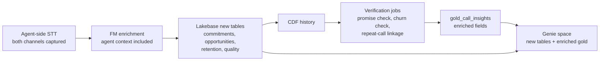

# Agent-Side STT — Revenue-Impact Use Cases

**Status:** Draft v0.1
**Last updated:** 2026-06-26
**Companions:** architecture → `docs/ARCHITECTURE.md` · data model → `docs/DATA_MODEL.md` · PRD → `docs/PRD.md`

---

## Context

The current pipeline captures and transcribes the **customer's** speech
(customer→agent direction). Each customer utterance drives FM enrichment
(intent, sentiment, signals) and Lakebase-backed agent assist.

This document defines four use cases that require transcribing the **agent's**
speech (agent→customer direction) — specifically those with direct,
quantifiable revenue impact through the customer experience.

All four build on the existing architecture: the same STT provider produces
agent utterances, the Foundation Model evaluates them, Lakebase persists
live state, and Genie enables portfolio analytics over the results.

---

## Prerequisite: two-sided transcription

Deepgram (or any STT adapter) already supports multichannel / diarized
capture (`diarize: true`, `multichannel: true` in `config.yaml`). The
change is operational, not architectural:

| Component | Current state | Required change |
|---|---|---|
| STT capture | Customer channel only | Both channels (agent + customer) |
| `live_call_utterances` | `speaker_role = customer` | Add `speaker_role = agent` rows |
| FM enrichment prompt | Reasons over customer turns only | Include agent turns for context |
| Lakebase `call_state` | Customer-side signals | Add agent-side signals |
| Gold extraction | Summarizes customer side | Full two-sided summary |

The `TranscriptEvent` model and `SILVER_CALL_UTTERANCES` schema already
carry `speaker_role` — no schema migration needed for basic capture.

---

## Use case 1: Promise tracking & revenue leakage prevention

### Problem

Agents verbally commit to actions during calls — fee waivers, credits,
callbacks, plan changes — but not all commitments are executed before the
call ends or within the promised timeframe. The customer calls back, AHT
doubles, trust erodes, and the account is at elevated churn risk.

Today, broken promises are invisible until the repeat call arrives.

### How agent-side STT enables this

| Step | What happens |
|---|---|
| **Detect** | FM extracts structured `agent_commitments` from agent utterances: `{type, amount, deadline, fulfilled}` |
| **Track** | Each commitment is persisted to Lakebase (`agent_commitments` table) with `fulfilled = false` |
| **Verify** | Post-call job cross-references commitments against system-of-record changes (billing_adjustments, invoices, payments) |
| **Alert** | Unfulfilled commitments past deadline trigger supervisor alert or automated follow-up |
| **Analyze** | Genie answers: "What % of verbal waivers were actually applied? Which agents have the highest broken-promise rate?" |

### Data model additions

```
AGENT_COMMITMENTS {
    string commitment_id PK
    string call_id FK          → call_facts.call_id
    string customer_id FK      → customers.customer_id
    string agent_id FK         → agents.agent_id
    string commitment_type     -- waiver | credit | callback | plan_change | refund | escalation
    decimal promised_amount    -- nullable; dollars committed
    string promised_action     -- free-text FM extraction: "waive $50 late fee on INV-2045"
    timestamp promised_by      -- nullable; deadline extracted from speech ("by end of day")
    boolean fulfilled          -- set by verification job
    timestamp fulfilled_at     -- nullable
    string fulfillment_method  -- billing_adjustment | manual | not_fulfilled
    timestamp detected_at      -- when FM extracted the commitment
}
```

Relationships:
- `agent_commitments.call_id` → `call_facts.call_id`
- `agent_commitments.customer_id` → `customers.customer_id`
- `agent_commitments.agent_id` → `agents.agent_id`

### Live assist integration

During the call, `call_state.state` gains an `open_commitments[]` array.
The agent assist UI renders these as a checklist. If the agent says
*"I'll waive your late fee"* but hasn't triggered the waiver workflow
before call close, the UI surfaces a blocking reminder.

### Revenue impact

| Metric | Mechanism | Industry benchmark |
|---|---|---|
| Repeat call reduction | Fulfilled promises eliminate reason to call back | Each repeat call costs $5–12; 20–30% of callbacks are broken-promise driven |
| Churn prevention | Broken promises are the #1 driver of "trust erosion" churn | 67% of churn is preventable with better post-interaction follow-through (Gartner) |
| Agent accountability | Promise fulfillment rate becomes a coachable KPI | Top-quartile agents fulfill >95%; bottom-quartile <70% |

### Sample Genie questions

- What percentage of verbal fee waivers were actually applied in billing this month?
- Which agents have the highest unfulfilled commitment rate?
- How many repeat calls originated from a broken promise in the prior call?
- Average time between promise detection and fulfillment, by commitment type?
- Total dollar amount of commitments made but not fulfilled, by customer segment?

---

## Use case 2: Upsell & cross-sell capture

### Problem

Agents surface upgrade offers, add-on services, or plan changes during
calls. The customer shows interest — asks a follow-up question, says
*"that sounds good"* — but the agent doesn't process the transaction, gets
distracted by the next issue, or the customer says *"let me think about
it"* and nobody follows up.

These are **warm leads that go cold** because the moment of interest is
never captured as a structured, actionable record.

### How agent-side STT enables this

| Step | What happens |
|---|---|
| **Detect offer** | FM identifies when the agent mentions a product, plan, or promotion (agent utterance) |
| **Detect response** | FM classifies the customer's response: `accepted`, `interested`, `deferred`, `declined` |
| **Capture** | Structured `sales_opportunities` record persisted to Lakebase with offer details and customer disposition |
| **Act (real-time)** | If `deferred` — agent assist prompts: "Customer showed interest in Premium plan. Offer to send details by email?" |
| **Act (post-call)** | `deferred` opportunities feed CRM follow-up queue with context: what was offered, what the customer said, and when |
| **Analyze** | Genie answers: "Which offers convert best by segment? What's our deferred-to-closed rate? Revenue left on the table?" |

### Data model additions

```
SALES_OPPORTUNITIES {
    string opportunity_id PK
    string call_id FK          → call_facts.call_id
    string customer_id FK      → customers.customer_id
    string agent_id FK         → agents.agent_id
    string offer_type          -- plan_upgrade | add_on | promotion | retention_offer
    string product_offered     -- free-text FM extraction: "Premium plan at $49/mo"
    decimal offer_value        -- nullable; monthly or one-time value
    string customer_response   -- accepted | interested | deferred | declined
    string customer_verbatim   -- the customer's actual words (post-redaction)
    string follow_up_action    -- nullable; "send_email" | "schedule_callback" | "none"
    boolean converted          -- did the opportunity result in a transaction?
    timestamp converted_at     -- nullable
    decimal conversion_value   -- nullable; actual ARR/revenue from conversion
    timestamp detected_at
}
```

Relationships:
- `sales_opportunities.call_id` → `call_facts.call_id`
- `sales_opportunities.customer_id` → `customers.customer_id`
- `sales_opportunities.agent_id` → `agents.agent_id`

### Live assist integration

When the FM detects a customer response of `interested` or `deferred`,
the agent assist UI surfaces a nudge:

> "Customer expressed interest in [product]. Confirm enrollment or
> schedule follow-up?"

For `accepted`, the UI prompts the agent to complete the transaction
before closing the call — similar to the existing billing adjustment
flow.

### Revenue impact

| Metric | Mechanism | Industry benchmark |
|---|---|---|
| Missed conversion recovery | Structured capture of warm leads that currently vanish | Contact centers miss 15–25% of in-call upsell opportunities (McKinsey) |
| Deferred-to-closed rate | Timely follow-up on "let me think about it" responses | Warm leads contacted within 24h convert at 3–5x the rate of cold outreach |
| Offer effectiveness | Portfolio-level view of which offers land with which segments | Enables data-driven offer design; top-performing offers can be 4x more effective |
| Agent coaching | Identify agents who create offers but fail to close, or never offer at all | Coaching on offer timing and framing can lift conversion 10–20% |

### Sample Genie questions

- How many upsell opportunities were detected this month, and what was the conversion rate?
- Which product offers have the highest acceptance rate by customer segment?
- Total revenue from converted in-call opportunities vs. estimated revenue left on the table?
- Which agents generate the most upsell opportunities? Which have the best conversion rate?
- What is the average time from "deferred" opportunity to conversion (or abandonment)?
- For enterprise-segment customers, which add-ons are most frequently offered but declined?

---

## Use case 3: Churn prevention through retention offer effectiveness

### Problem

When a customer signals cancellation risk, agents are expected to offer
retention incentives — free months, discounts, plan downgrades. But three
things go wrong:

1. **No offer made** — the agent skips the retention playbook entirely on
   high-value accounts.
2. **Wrong offer** — the agent offers a generic discount to a customer who
   wanted a plan change, or a $10 credit to a $5,000/yr enterprise account.
3. **Offer made, outcome unknown** — the agent says *"I can give you
   3 months free"*, but whether the customer accepted, and whether it
   actually prevented churn, is never tracked.

Without agent-side transcription, retention offer behavior is a black box.

### How agent-side STT enables this

| Step | What happens |
|---|---|
| **Detect risk signal** | FM identifies `cancellation_risk` intent from customer utterance (already exists in current pipeline) |
| **Detect offer** | FM identifies the specific retention offer the agent made (requires agent utterance) |
| **Detect outcome** | FM classifies the customer response to the offer: `accepted`, `rejected`, `negotiated`, `no_response` |
| **Track** | `retention_offers` record persisted with offer details, customer response, and account value context |
| **Flag gaps** | If `cancellation_risk` detected but no retention offer made within N agent turns → supervisor alert |
| **Measure** | Post-call: did the customer stay? 30/60/90-day churn tracking linked back to the offer |
| **Analyze** | Genie answers: "What % of at-risk calls include a retention offer? Which offers save the highest-value accounts?" |

### Data model additions

```
RETENTION_OFFERS {
    string offer_id PK
    string call_id FK          → call_facts.call_id
    string customer_id FK      → customers.customer_id
    string agent_id FK         → agents.agent_id
    string offer_type          -- free_months | discount | plan_downgrade | credit | feature_unlock | custom
    string offer_details       -- free-text FM extraction: "3 months free on current plan"
    decimal offer_cost         -- estimated cost to the business (e.g. 3 × $49 = $147)
    decimal account_arr        -- customer's ARR at time of offer (for ROI calculation)
    string customer_response   -- accepted | rejected | negotiated | no_response
    boolean churn_prevented    -- set by 30/60/90-day post-call job
    timestamp churn_check_date -- when prevention status was last evaluated
    string risk_signal         -- the customer utterance that triggered the risk detection
    timestamp detected_at
}
```

Additionally, a derived metric on `gold_call_insights`:

```
retention_offer_made    BOOLEAN   -- was a retention offer detected on this call?
retention_offer_type    STRING    -- nullable; type if offered
retention_outcome       STRING    -- accepted | rejected | negotiated | no_offer_made
```

Relationships:
- `retention_offers.call_id` → `call_facts.call_id`
- `retention_offers.customer_id` → `customers.customer_id`
- `retention_offers.agent_id` → `agents.agent_id`

### Live assist integration

When `cancellation_risk` is detected in the customer utterance:

1. Agent assist UI highlights the risk signal and the customer's ARR/segment.
2. If no retention offer is detected in the agent's next 2–3 turns, the UI
   nudges: *"Customer is at cancellation risk ($4,800 ARR). Consider offering
   [recommended retention action based on segment/plan]."*
3. Once an offer is made, the UI tracks the customer's response and prompts
   the agent to confirm acceptance or escalate.

### Revenue impact

| Metric | Mechanism | Industry benchmark |
|---|---|---|
| Retention rate on at-risk calls | Ensures every at-risk call gets an appropriate offer | 5–15% of at-risk calls receive no retention offer; fixing this alone saves measurable ARR |
| Offer ROI | Compare offer cost vs. saved ARR — kill low-ROI offers, double down on effective ones | Best retention offers deliver 10–25x ROI (offer cost vs. retained ARR) |
| Agent retention skill gap | Identify agents who avoid difficult retention conversations | Bottom-quartile agents make offers on <40% of risk calls; top-quartile >90% |
| Churn prediction input | Offer-response patterns feed churn models | "Rejected retention offer" is a strong churn predictor (30-day P(churn) > 60%) |

### Sample Genie questions

- What percentage of `cancellation_risk` calls included a retention offer this quarter?
- Which retention offer types have the highest acceptance rate by customer segment?
- For enterprise customers, what is the average ARR saved per retention offer?
- Which agents handle the most at-risk calls but make offers on fewer than 50%?
- What is the 90-day churn rate for customers who accepted vs. rejected a retention offer?
- Total ARR at risk on calls where no retention offer was made?

---

## Use case 4: First call resolution improvement

### Problem

First Call Resolution (FCR) is the single most impactful contact center
KPI. Every repeat call costs $5–12 in direct handling cost, increases
customer effort score, and correlates with higher churn. Industry
benchmark: each 1% improvement in FCR saves ~$1M/yr for a mid-size
contact center.

Today, repeat calls are detected **after** they happen — a customer calls
back about the same issue, and only then does the system realize the first
call didn't resolve it. The root cause (unclear agent explanation, missed
step, customer confusion) is never captured.

With only customer-side transcription, you know *what* the customer
wanted. With both sides, you know *how* the agent attempted to resolve
it and *whether* the customer understood.

### How agent-side STT enables this

| Step | What happens |
|---|---|
| **Score resolution clarity** | FM evaluates the agent's closing explanation: did they state next steps, confirm understanding, set expectations? |
| **Detect confusion** | FM identifies customer confusion signals *in response to* agent explanations (requires both sides in context) |
| **Predict repeat call** | ML/rules model: low clarity score + high customer confusion + unresolved sentiment → repeat call likely |
| **Intervene** | Real-time: UI nudges agent to re-explain or confirm. Post-call: trigger proactive follow-up (email, SMS) |
| **Track** | `resolution_quality` record links the agent's resolution approach to whether the customer called back within 7 days |
| **Analyze** | Genie answers: "What's our FCR rate by agent? Which resolution approaches lead to the fewest callbacks?" |

### Data model additions

```
RESOLUTION_QUALITY {
    string quality_id PK
    string call_id FK          → call_facts.call_id
    string customer_id FK      → customers.customer_id
    string agent_id FK         → agents.agent_id
    double clarity_score       -- 0.0–1.0; FM-assessed clarity of agent's resolution explanation
    boolean next_steps_stated  -- did the agent explicitly state what happens next?
    boolean understanding_confirmed -- did the agent confirm the customer understood?
    boolean customer_confusion_detected -- did the customer express confusion after the explanation?
    string confusion_indicator -- nullable; FM extraction: "customer asked 'wait, so what do I do?'"
    boolean repeat_call        -- did the customer call back within 7 days on the same issue?
    string repeat_call_id      -- nullable FK → call_facts.call_id of the repeat call
    int days_to_repeat         -- nullable; days between this call and the repeat
    string resolution_approach -- free-text FM extraction: "explained payment plan terms, confirmed autopay setup"
    timestamp evaluated_at
}
```

Additionally, enrichment to `gold_call_insights`:

```
resolution_clarity_score  DOUBLE    -- 0.0–1.0 FM-assessed score
repeat_call_within_7d     BOOLEAN   -- linked by customer_id + primary_intent within window
```

Relationships:
- `resolution_quality.call_id` → `call_facts.call_id`
- `resolution_quality.customer_id` → `customers.customer_id`
- `resolution_quality.agent_id` → `agents.agent_id`
- `resolution_quality.repeat_call_id` → `call_facts.call_id` (nullable)

### Live assist integration

As the call approaches resolution (FM detects `confirm_proceed` or agent
begins closing):

1. FM scores the agent's resolution explanation in real time.
2. If `clarity_score < 0.6` or `customer_confusion_detected = true`, the
   UI nudges: *"Customer may not have understood. Consider restating the
   resolution steps."*
3. If `next_steps_stated = false` before call close, UI prompts:
   *"Confirm next steps with the customer before closing."*

Post-call, if the prediction model flags a likely repeat call, a
proactive follow-up is triggered before the customer calls back.

### Revenue impact

| Metric | Mechanism | Industry benchmark |
|---|---|---|
| FCR rate improvement | Catch unclear resolutions before the call ends | 1% FCR improvement ≈ $1M/yr savings (mid-size center) |
| Repeat call prevention | Proactive follow-up on predicted repeats | Proactive outreach resolves 40–60% of predicted repeats before callback |
| AHT reduction (indirect) | Clearer first-call resolution → shorter repeat calls when they do occur | Repeat calls average 1.5x the AHT of first calls |
| CSAT improvement | Customer effort drops when issues resolve on the first call | FCR has the strongest single correlation with CSAT (r = 0.75+) |
| Agent coaching | Clarity score + repeat-call linkage identifies specific coaching needs | Targeted coaching on resolution framing lifts agent-level FCR 5–10% |

### Sample Genie questions

- What is our first call resolution rate this month, and how does it compare to last month?
- Which agents have the lowest resolution clarity scores?
- For calls with `clarity_score < 0.5`, what is the repeat-call rate vs. calls above 0.8?
- What are the most common confusion indicators detected after agent explanations?
- How many repeat calls could have been prevented by proactive follow-up (predicted but not actioned)?
- Average days to repeat call, by primary intent?
- Total handling cost of repeat calls this quarter (repeat count × average AHT × cost per minute)?

---

## Cross-cutting architecture impact

### FM prompt changes

The Foundation Model enrichment prompt (`enrich/fm.py`) currently receives
only the customer utterance and Lakebase context. For these use cases, the
prompt must include **recent agent utterances** as conversation context.

The FM call is still **utterance-bound** (one call per customer turn), but
now includes the agent's preceding response(s) as context, not as the
trigger. Token cost increases modestly (~200–400 tokens of agent context
per call).

### New FM extraction targets (per customer turn)

| Field | Type | Use case |
|---|---|---|
| `agent_commitments[]` | array of `{type, amount, action, deadline}` | #1 Promise tracking |
| `offer_detected` | `{type, product, value}` or null | #2 Upsell capture |
| `customer_offer_response` | `accepted \| interested \| deferred \| declined` or null | #2 Upsell capture |
| `retention_offer` | `{type, details, cost}` or null | #3 Retention effectiveness |
| `retention_response` | `accepted \| rejected \| negotiated \| no_response` or null | #3 Retention effectiveness |
| `resolution_clarity` | `{score, next_steps_stated, understanding_confirmed}` | #4 FCR improvement |
| `customer_confusion` | `{detected, indicator}` | #4 FCR improvement |

### Lakebase table additions

| Table | Purpose | Serves |
|---|---|---|
| `agent_commitments` | Verbal promises with fulfillment tracking | Use case #1 |
| `sales_opportunities` | Detected upsell/cross-sell moments with outcomes | Use case #2 |
| `retention_offers` | Retention offers on at-risk calls with churn linkage | Use case #3 |
| `resolution_quality` | Per-call resolution clarity and repeat-call linkage | Use case #4 |

All four tables follow the existing pattern: Lakebase writes during the
call, CDF publishes history to UC, gold refresh aggregates for Genie.

### Genie space additions

New tables exposed to the Genie space:

- `agent_commitments` — promise tracking and fulfillment analytics
- `sales_opportunities` — pipeline and conversion analytics
- `retention_offers` — retention effectiveness and churn correlation
- `resolution_quality` — FCR and resolution clarity analytics

Enrichments to existing `gold_call_insights`:

- `retention_offer_made`, `retention_offer_type`, `retention_outcome`
- `resolution_clarity_score`, `repeat_call_within_7d`

### Pipeline additions



### Phasing recommendation

| Phase | Use cases | Rationale |
|---|---|---|
| **Phase 3a** | #1 Promise tracking, #4 FCR improvement | Highest immediate impact; smallest data model addition; no external system integration |
| **Phase 3b** | #3 Retention offer effectiveness | Requires 30/60/90-day churn lookback; needs time to accumulate outcome data |
| **Phase 3c** | #2 Upsell & cross-sell capture | Highest revenue upside but requires CRM integration for follow-up workflow |
