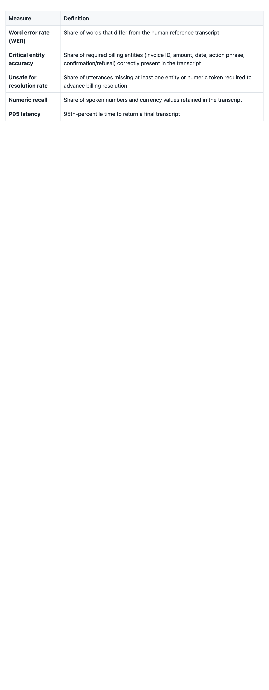
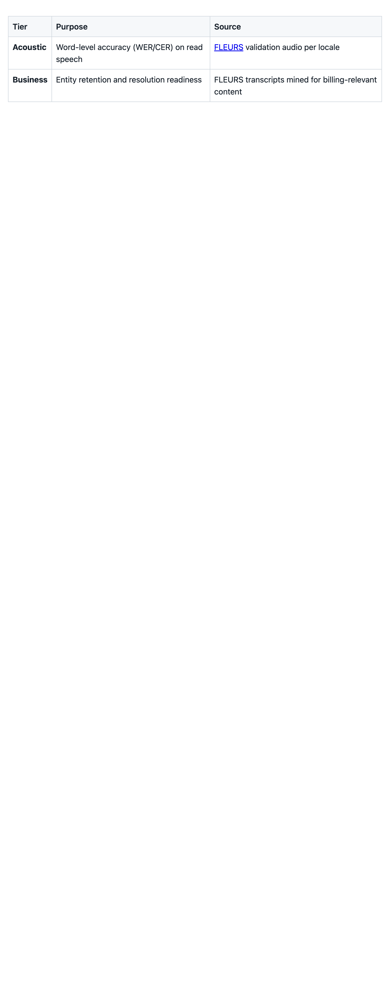
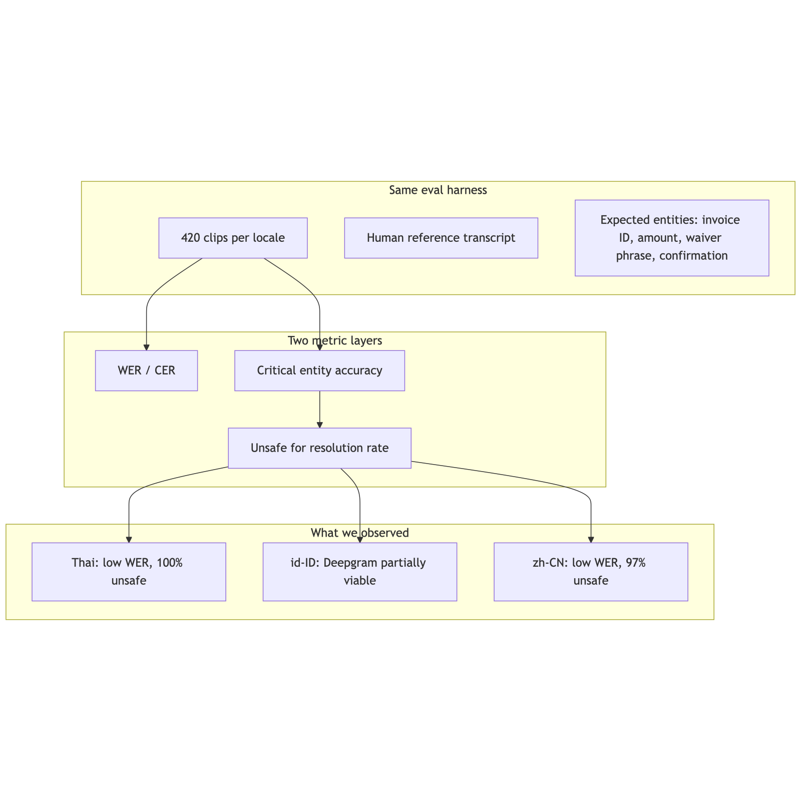
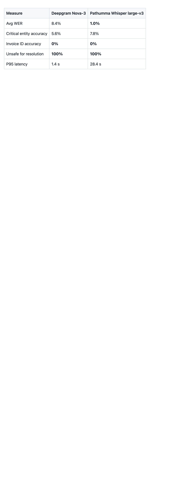
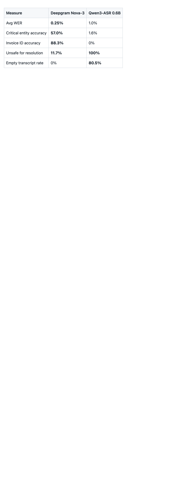
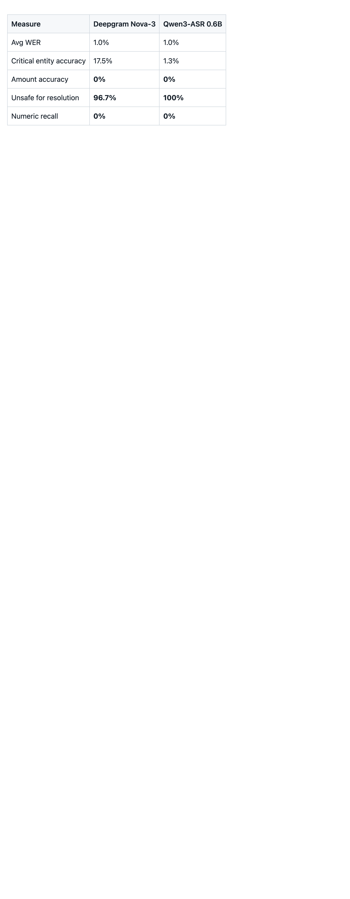
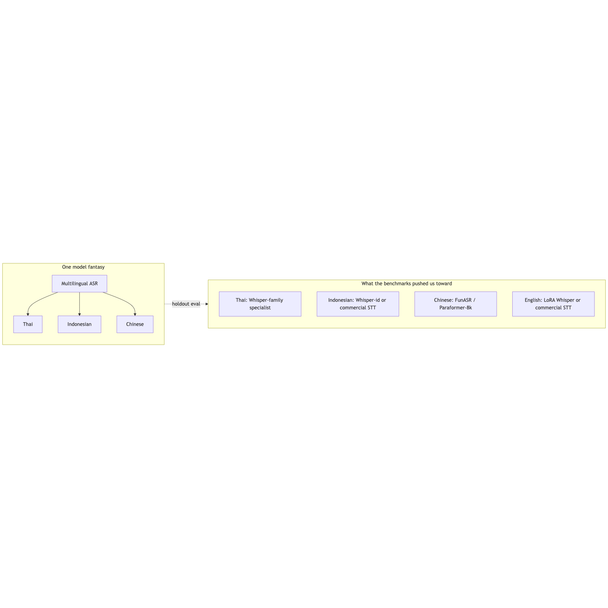
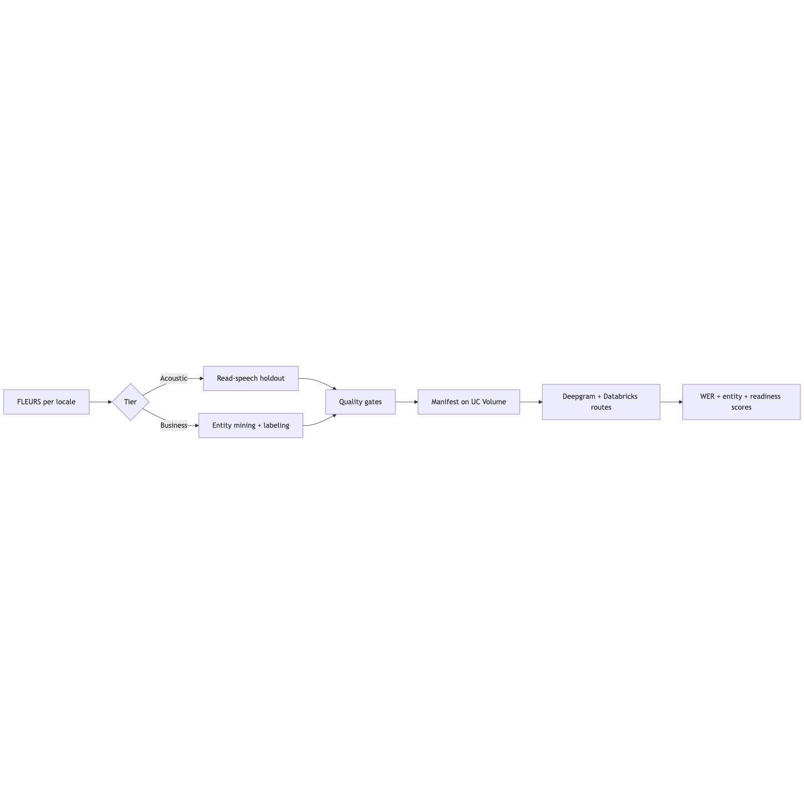
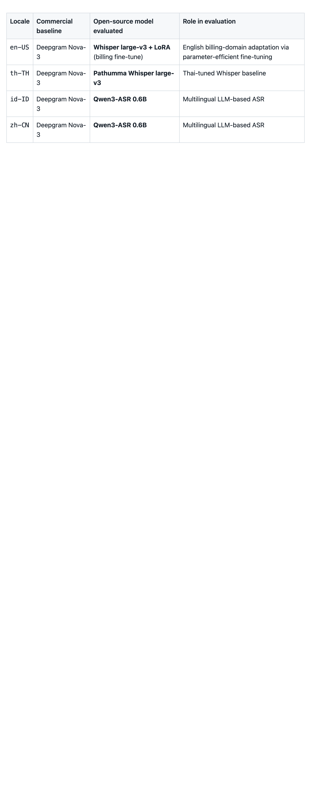
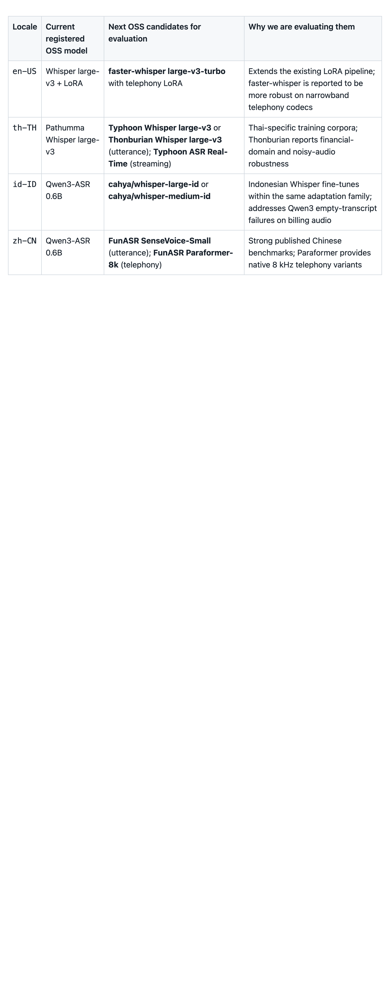

# Why Is It Hard to Build Voice Models for Asian Languages?

## The use case

We are building **live agent assist** for billing contact centers on Databricks. A human agent stays on the call with the customer. Speech from the conversation is converted to text in near real time; the application then surfaces account context, detects billing intent (such as a late-fee waiver or payment-plan request), and tracks whether the case can close safely.

The **voice model** in this architecture is the speech-to-text layer — automatic speech recognition (ASR). It is not the reasoning engine and not an autonomous voice bot. Downstream models and governed account data depend on the transcript being accurate enough to preserve invoice IDs, amounts, and short customer confirmations. If ASR drops those details, the agent may see a fluent summary while the billing workflow cannot proceed.

The use case is expected to support multiple interaction languages — English, Thai, Indonesian, and Chinese — while account records remain canonical: invoice IDs such as `INV-90022`, amounts in USD, and customer keys stored in English. That pattern is common in regional contact centers and is especially demanding for speech recognition.

## A call that exposes the problem

Consider a billing support call in Thai. The customer asks to waive a $50 late fee on invoice `INV-90022` and set up a payment plan. They may speak the invoice number in English or approximate it phonetically in Thai; either way, the transcript must retain `INV-90022` for the case to advance. When the agent asks for confirmation, a brief reply — the Thai equivalent of "yes, go ahead" — must also survive transcription before a waiver can post to the account.

That is where our evaluation focused. We benchmarked Thai, Indonesian, and Chinese ASR on billing-domain audio and asked a practical question: **can we trust the transcript to support resolution**, not merely how many words were wrong?

## What we found

Word error rate can appear acceptable while the transcript remains unsuitable for a resolution workflow. The failure mode also varies materially by language. This post summarizes what we learned — not as a survey of every Asian language, but as a practical account of where general-purpose voice models fall short in Southeast Asia and China for live billing agent assist.

## Terms used in this post

**Agent assist** — a human agent handles the call; software transcribes speech, retrieves account context, and recommends next steps. The agent remains in control.

**Automatic speech recognition (ASR)** converts spoken audio into text. Commercial and open-source providers — including Deepgram and models in the Whisper family — are ASR systems.

**Word error rate (WER)** measures how many words differ between a reference transcript and the ASR output. Lower is better. WER is the standard academic metric; it does not, by itself, indicate whether a transcript is safe for downstream business logic.

**Critical entity accuracy** measures how reliably the transcript preserves billing-relevant content: invoice IDs, amounts, dates, waiver or payment-plan phrases, and short confirmations or refusals.

**Unsafe for resolution rate** is the share of utterances whose transcripts are missing information required to advance or close a billing case. On the Thai call above, if the customer confirms the waiver but the transcript omits `INV-90022`, the wording may look reasonable while the case cannot close safely.

## The naive approach: deploy one multilingual model

The straightforward path is to route every locale through a single strong multilingual model. Qwen3-ASR, an open-source multilingual ASR system, covers 52 languages. Whisper, another widely used open-source family, covers 99. Published benchmarks report competitive WER. Integrate one model and proceed.

We evaluated that approach. For English we applied low-rank adaptation (LoRA), a parameter-efficient fine-tuning method, on billing-domain utterances. For Thai, Indonesian, and Chinese we registered open-source candidates, conducted a per-locale comparative evaluation, and scored each against a **fixed benchmark corpus** of 420 utterances per language with human-verified transcripts and labeled invoice IDs, amounts, waiver phrases, and confirmations.

Three findings emerged immediately.

**First, WER is an incomplete indicator.** On Thai, one model achieved approximately 1% WER while classifying **100% of utterances as unsafe for resolution**. Another recorded ~8% WER with the same outcome. Strong WER did not imply the billing workflow could rely on the transcript.

**Second, Asian locales are not interchangeable.** Indonesian results from Deepgram Nova-3, a commercial speech-to-text service, were partially viable. Chinese and Thai were not — despite identical evaluation methodology and the same commercial provider family.

**Third, multilingual coverage on leaderboards obscures domain and channel risk.** A model that performs well on clean, read speech can still fail on short confirmations, alphanumeric invoice IDs, or narrowband telephony audio.

## What the application requires beyond transcription

Contact-center voice is not general-purpose transcription. The system must preserve, in the final utterance:

- Invoice IDs (`INV-90022`) even when the conversation is in Thai or Indonesian
- Dollar amounts expressed in local phrasing
- Billing-action phrases (late-fee waiver, payment plan)
- Minimal confirmations and refusals that determine whether a case may close

We evaluate these as **entity groups** alongside WER. A model is considered for promotion only when it meets thresholds on **critical entity accuracy** and **unsafe for resolution rate**.

This requirement is especially demanding for Asian languages because utterances frequently combine local grammar with **canonical English identifiers** the business system stores as `INV-900xx` and USD amounts.

## How we measure operational fitness

Before reviewing the results, it is worth defining how an utterance is judged.

A transcript can exhibit low WER and still be unsafe. Conversely, a higher WER does not always prevent resolution if the critical entities are intact.

## How we prepared evaluation data

Fair model comparison depends on the dataset before it depends on the model. We standardized that work in `scripts/ml_asr/` — a five-step pipeline backed by `backend/genie_voice/ml_asr/` and configured in `config/ml_asr_eval.yaml`. Artifacts land on Unity Catalog Volumes so preparation, quality review, and scoring share the same manifests.

### Two evaluation tiers

We separate **acoustic** fitness from **business** fitness:

Acoustic tier answers whether a model hears the language. Business tier answers whether it preserves invoice IDs, amounts, waiver language, and confirmations — the fields our agent-assist workflow requires.

### Step 1 — Build holdout corpora

`01_datasets.sh` runs on Databricks serverless and materializes two datasets per locale (`en-US`, `th-TH`, `id-ID`, `zh-CN`):

- **`fleurs_acoustic_v1`** — licensed human read speech from FLEURS, held out from training use.
- **`fleurs_business_v1`** — the same source, filtered through **entity mining**: transcripts must pass billing keyword checks, scenario classification (dispute, payment confirmation, refund request, and similar), and entity extraction rules for invoice patterns, currency amounts, and decision phrases in the target language.

Mining is locale-aware. Thai, Indonesian, and Chinese each carry their own billing-term lexicon and confirmation/refusal patterns rather than relying on English-only labels.

Each selected clip is written to a JSONL manifest with a human reference transcript, expected entity labels, scenario metadata, and a normalized audio file on the Volume.

### Step 2 — Dataset quality gates

`02_quality.sh` runs a **semantic quality review** on those manifests before any model is scored. This is not a clip-count check. We measure:

- **Entity label quality** — are invoice IDs and amounts plausible, not false positives from general speech?
- **Scenario consistency** — does the transcript match the assigned billing scenario?
- **Audio suitability** — duration within bounds, readable audio bytes
- **Duplicate and suspicious-label rates** — caps on near-duplicate transcripts and mis-tagged entities

Datasets that fail these gates do not advance to model evaluation.

### Steps 3–5 — Register, serve, and score

The remaining steps complete the loop:

- **`03_register.sh`** — register open-source candidates in Unity Catalog (Whisper LoRA for English; locale-specific routes for Thai, Indonesian, and Chinese).
- **`04_serve.sh`** — deploy Model Serving endpoints for `databricks_*` routes.
- **`05_eval.sh`** — score every route in the evaluation matrix: Deepgram Nova-3 (commercial API) and Databricks-hosted models through the **same manifest and scorer**.

Business-tier scoring applies `assess_readiness()` — the same unsafe-for-resolution logic used in the tables below — alongside WER and per-entity accuracy. Results sync to the in-app ASR benchmark view for side-by-side comparison.

For promotion-scale decisions, we extended this methodology to a larger contact-center business holdout (**420 utterances per locale**) with synthetic billing scenarios and labeled invoice IDs, amounts, and confirmations. The benchmark tables in the next section report that holdout; the `ml_asr` pipeline is the repeatable path we use to iterate.

## Benchmark results: identical methodology, divergent outcomes

Each locale was evaluated against a **420-utterance contact-center business holdout**, scored with the same readiness logic as the `ml_asr` business tier. The tables below compare Deepgram Nova-3 with the leading open-source route registered on Databricks at the time of evaluation.

### Thai (`th-TH`)

Pathumma Whisper, a Thai-tuned open-source model, achieved substantially lower WER. Neither system produced transcripts suitable for waiver detection. Invoice IDs were not recovered on any utterance.

### Indonesian (`id-ID`)

Indonesian was the most favorable locale for the commercial provider. Qwen3-ASR, an open-source multilingual LLM-based ASR model, returned empty transcripts on most utterances, recovered no invoice IDs, and exhibited unacceptable latency.

### Chinese (`zh-CN`)

WER remained near 1% for both systems. Amounts and invoice IDs failed at scale. For Chinese billing audio, numeric fidelity — not general word accuracy — was the limiting factor.

## Why Asian languages present distinct engineering challenges

### 1. Training data rarely matches production conditions

Most open ASR corpora emphasize read speech, high-resource languages, and clean wideband audio. Asian contact centers introduce additional complexity:

- **Tonal and syllable-timed phonology** (Thai, Mandarin), where small acoustic errors alter meaning
- **Particle-rich grammar** (Indonesian), where phrase boundaries affect short confirmations
- **Code-switching** between local language and English product identifiers
- **Narrowband telephony** (8 kHz), which removes spectral cues present in 16 kHz wideband training data

Published work on clinical and rural telephony reports WER increasing by a factor of three or more when models trained on clean audio are applied to 8 kHz phone channels — a domain shift, not a parameter adjustment ([arXiv 2512.16401](https://arxiv.org/html/2512.16401v5)). Resampling 8 kHz audio to 16 kHz is necessary but insufficient; codec compression introduces distortions that bandwidth limiting alone does not replicate.

### 2. Multilingual models are not fungible across the region

Language coverage in a model card does not imply uniform fitness:

- **SenseVoice** performs strongly on Chinese but does not support Thai or Indonesian
- **Canary** targets European languages
- **Qwen3-ASR** lists Thai, Indonesian, and Chinese, yet our domain benchmark and telephony evaluations revealed severe failure modes on billing utterances and narrowband audio
- **Whisper** spans 99 languages but requires per-locale adaptation for billing entities and telephony conditions

A single model serving English, Thai, Indonesian, and Chinese in a regulated billing workflow is not a viable default. We adopted **per-locale routing** — distinct model families by language — which increases operational complexity but reflects the empirical results.

### 3. Word accuracy and business safety measure different properties

Research on named-entity recognition over ASR output demonstrates that downstream task error can diverge sharply from WER — transcripts may appear fluent while populating the wrong entity values ([Why Aren't We NER Yet?, ACL 2023](https://doi.org/10.18653/v1/2023.acl-long.98)).

We observed the same pattern in Thai: conversational content transcribed with reasonable fidelity while **invoice IDs scored 0%** across all evaluated models. Intent and action detection depend on identifiers and confirmations remaining in the text.

The relevant question for voice-enabled billing is shifting from how many words were incorrect to how many utterances would permit an incorrect billing action.

### 4. Business records remain canonical even when the conversation is localized

Supported interaction languages include `en-US`, `th-TH`, `id-ID`, and `zh-CN`. Customer-facing responses may be localized. Account data does not: invoice IDs remain `INV-900xx`, amounts in USD, customer keys such as `CUST-4028`.

Regional enterprises commonly operate this way; academic speech corpora rarely reflect it. Models trained for monolingual output must still deliver **mixed-language fidelity** — for example, Thai discourse surrounding an English invoice number spoken aloud.

## What we can do better

The evaluation clarified where investment should go next. The tables below list the **open-source models we registered and scored on Databricks**, the commercial baseline used for comparison, and the **candidates we plan to evaluate next** based on locale fit, published benchmarks, and the failure modes observed in our holdout.

### Models evaluated

Deepgram Nova-3 served as the commercial reference across all four locales. Each open-source model was registered in Unity Catalog, deployed to a Databricks Model Serving endpoint, and scored through the same `ml_asr` manifests and readiness logic.

**What the holdout showed about these OSS routes:**

- **Whisper LoRA (English)** — viable starting point; extend with telephony-band augmentation before PSTN deployment.
- **Pathumma Whisper (Thai)** — strong WER (~1%) but **0% invoice ID recovery** and 100% unsafe for resolution; word accuracy alone is insufficient.
- **Qwen3-ASR 0.6B (Indonesian)** — 80.5% empty transcripts, 0% invoice IDs, 100% unsafe; materially worse than Deepgram on domain audio.
- **Qwen3-ASR 0.6B (Chinese)** — 83.8% empty transcripts, 0% amounts and invoice IDs, 100% unsafe; unsuitable for billing holdout despite competitive published multilingual scores.

### Next open-source models to evaluate by locale

Our objective is to identify self-hosted speech-to-text routes that meet business-tier acceptance criteria on Databricks. No single open-source model covers English, Thai, Indonesian, and Chinese with acceptable billing-entity fidelity, so the next evaluation cycle should test **a distinct model per locale** rather than another multilingual checkpoint.

The table below lists **open-source candidates for the next comparative evaluation**. These are not committed production selections. Deepgram Nova-3 remains the commercial reference and a viable production option where registered OSS routes have not yet passed acceptance gates.

The following models are **deprioritized** for this use case based on language coverage or observed channel fit: **SenseVoice** (no Thai or Indonesian), **Canary-1B-v2** (European languages only), and **Qwen3-ASR** on telephony or billing-entity paths until domain holdout performance improves.

Each candidate must pass the same business-tier acceptance criteria — critical entity accuracy and unsafe-for-resolution rate — before it can replace a registered route.

### 1. Richer business audio, especially for Thai and Chinese

FLEURS provides licensed human speech and a reproducible mining path, but it is still read speech — not live contact-center dialogue. Thai and Chinese remain **100% and 97% unsafe**, respectively, on the promotion holdout. We need larger corpora that combine conversational delivery, billing-domain phrasing, and mixed-language invoice references, not only filtered read-speech clips.

### 2. Per-locale routing instead of multilingual defaults

The holdout confirmed that multilingual coverage on a model card does not predict locale fitness. Indonesian Deepgram results were partially viable while Qwen3-ASR failed on the same audio. Thai Pathumma Whisper achieved low WER without recovering invoice IDs. The evaluation roadmap above defines the next open-source routes to register, serve, and score through `03_register.sh` and `05_eval.sh`.

### 3. Telephony-conditioned evaluation and training

Current fine-tunes and holdouts target 16 kHz push-to-talk input. Public switched telephone network (PSTN) audio at 8 kHz is a separate domain. We should extend the `ml_asr` pipeline with narrowband corpora, codec-aware augmentation, and a distinct telephony tier — with **Paraformer-8k** for Chinese and telephony LoRA on faster-whisper for English and Indonesian as first candidates.

### 4. End-to-end scoring through the agent-assist layer

Utterance-level entity metrics are necessary but not sufficient. We should run held-out transcripts through the enrichment layer and measure whether ASR errors actually break waiver detection, payment-plan flags, and case-close validation — closing the gap between transcription scores and workflow outcomes.

### 5. Post-recognition entity normalization

Invoice ID repair from account context (mapping noisy spans such as "I NV9022" to `INV-90022` when unambiguous) may improve readiness without retraining. That uplift should be measured on the same business tier before relying on it in production.

### 6. Operational parity across routes

Pathumma Whisper on Thai reached a P95 utterance latency of approximately 28 seconds in one evaluation — unusable for live agent assist regardless of WER. **Typhoon ASR Real-Time** is the leading candidate for Thai streaming latency; any replacement route must meet serving targets comparable to commercial ASR before promotion.

### 7. Tighter integration of acoustic and business promotion criteria

The `ml_asr` pipeline already separates acoustic and business tiers. Promotion decisions should require passing **both**: acceptable WER on read speech and acceptable entity readiness on billing audio. A model that excels on one tier while failing the other — as Pathumma Whisper did on Thai — should not advance.

## Closing thought

Asian-language voice is difficult not because speech recognition is intractable, but because production requirements combine constraints that public benchmarks seldom evaluate jointly: tonal and morphologically varied speech, English canonical identifiers, brief confirmations, telephony channels, and downstream decisions that must not execute on incomplete transcripts.

Organizations building voice capabilities for the region should optimize for **operational safety by locale**, not a single multilingual WER figure. Our Thai benchmark illustrated the distinction clearly: a model can appear state of the art on word accuracy and remain entirely unsuitable for deployment.

## Appendix: evaluation protocol

Comparisons followed a consistent protocol: call-level train and test partitioning to prevent data leakage, a held-out benchmark corpus excluded from model selection, identical scoring logic across providers, and separate assessment planned for narrowband telephony audio. Results from microphone-quality 16 kHz audio do not generalize to PSTN channels.

## Sources and Further Reading

- [Why Aren't We NER Yet? (ACL 2023)](https://doi.org/10.18653/v1/2023.acl-long.98) — ASR errors versus downstream entity extraction
- [Navigating the Reality Gap: ASR for Clinical Telephony (arXiv 2512.16401)](https://arxiv.org/html/2512.16401v5) — clean versus telephony WER degradation
- [Qwen3-ASR Technical Report](https://arxiv.org/html/2601.21337) — multilingual coverage versus deployment fitness
- [FunASR](https://github.com/modelscope/FunASR) — Chinese ASR including 8 kHz telephony variants
- [FunASR SenseVoice](https://github.com/FunAudioLLM/SenseVoice) — Chinese utterance ASR candidate
- [Typhoon Whisper Large-v3](https://huggingface.co/typhoon-ai/typhoon-whisper-large-v3) — Thai-focused Whisper training
- [Typhoon ASR Real-Time](https://opentyphoon.ai/blog/en/typhoon-asr-realtime-release) — Thai streaming ASR candidate
- [Thonburian Whisper](https://huggingface.co/biodatlab/whisper-th-large-v3-combined) — Thai Whisper with financial-domain training
- [cahya/whisper-large-id](https://huggingface.co/cahya/whisper-large-id) — Indonesian Whisper fine-tunes
- [cahya/whisper-medium-id](https://huggingface.co/cahya/whisper-medium-id) — lighter Indonesian Whisper candidate
- [Databricks AI/BI Genie](https://docs.databricks.com/en/generative-ai/genie.html) — governed reasoning layer in the broader voice stack
