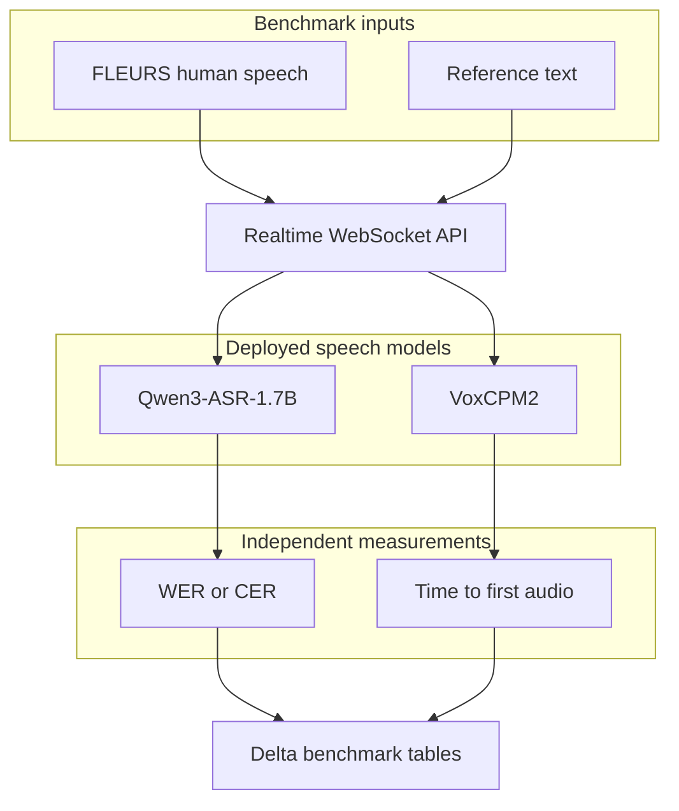

# Why Is It Hard to Build Voice Models for Asian Languages?

## The use case

We started with live agent assist for billing contact centers on Databricks. The first version listened to a customer call, transcribed each utterance, and surfaced account context and recommended actions to a human agent.

The system has since become a multilingual voice agent. A caller can speak naturally, hear a response in the same language, ask questions over governed data through Databricks Genie, and interrupt or continue the conversation without switching interfaces. That changed the model problem. Speech recognition still has to preserve names, amounts, and identifiers, but synthesis must now pronounce them intelligibly and maintain one stable voice across languages.

The current voice path uses [Qwen3-ASR-1.7B](https://huggingface.co/Qwen/Qwen3-ASR-1.7B) for recognition and [VoxCPM2](https://huggingface.co/openbmb/VoxCPM2) for synthesis. Both are open-source multilingual checkpoints that we package, register, and serve on Databricks GPU Model Serving. Their official language sets overlap on 24 languages, including English, Thai, Indonesian, Chinese, Hindi, Japanese, Korean, and several European languages.

## A call that exposes the problem

Consider the same Thai billing call that motivated the first version. The customer asks about a $50 late fee on invoice `INV-90022`, then asks how their balance compares with prior months.

Qwen3-ASR must recognize Thai speech while retaining an English-style invoice identifier and a USD amount. The reasoning layer must retrieve the correct account data. VoxCPM2 must then speak the answer in Thai without changing the number, mangling the identifier, or sounding like a different person on the next turn.

This is more demanding than accurate transcription in isolation. A voice model can perform well on clean read speech and still fail when speech contains code-switching, uncommon names, long numbers, background noise, or telephone-band audio. A synthesizer can sound natural in a demo sentence and still pronounce a business-critical identifier ambiguously.

## What we found

Moving from smaller per-language experiments to Qwen3-ASR-1.7B and VoxCPM2 improved the architecture substantially: one recognition endpoint, one synthesis endpoint, automatic language detection, a consistent cloned voice, and streamed audio output.

It did not make language-specific evaluation optional. In our current FLEURS run, English reached 83% word accuracy, Thai 74% character accuracy, Indonesian 72% word accuracy, and Chinese 67% character accuracy. The spread across all 24 supported languages was wider, from the low 80s to approximately 30%.

Those measurements answer a narrow question: how well does the deployed API transcribe clean, human read speech? They do not prove billing-entity accuracy, telephone robustness, or production readiness. The main lesson from the earlier work still holds, but the evidence is now cleaner: multilingual coverage is a starting point, not an acceptance criterion.

## Terms used in this post

**Automatic speech recognition (ASR)** converts spoken audio into text. Qwen3-ASR-1.7B is the recognition model in the current realtime path.

**Text-to-speech (TTS)** converts a text response into audio. VoxCPM2 is the synthesis model and can clone a speaker from a short reference recording.

**Word error rate (WER)** measures substitutions, deletions, and insertions relative to a human reference transcript. Lower is better.

**Character error rate (CER)** applies the same idea at character level. We use it for Chinese, Japanese, and Thai because whitespace is not a reliable word boundary for these scripts.

**Time to first audio (TTFA)** measures how long the caller waits before the first synthesized audio reaches playback. It is more relevant to conversation than the time required to render an entire sentence.

**Realtime in this system** means responsive turn-taking and streamed audio output. Recognition currently runs once an utterance is complete; it is not yet incremental word-by-word ASR.

## The naive approach: deploy one multilingual model

The attractive design is simple: choose one multilingual checkpoint, expose one endpoint, and treat every supported language identically. Qwen3-ASR-1.7B officially recognizes 30 languages, while VoxCPM2 synthesizes 30. Their intersection lets one voice stack cover 24 languages without maintaining a model per locale.

That consolidation is valuable. The API no longer needs to route Thai to one model family, Indonesian to another, and Chinese to a third. Qwen3-ASR can detect the spoken language, and the same language tag carries through reasoning and synthesis.

But one endpoint does not imply uniform quality. In the current FLEURS run, Japanese and English were near 83% accuracy while Vietnamese and Filipino were substantially lower. Thai, Indonesian, and Chinese also differed from one another even though they passed through the same checkpoint and serving path.

The practical design is therefore one multilingual default with measured exceptions—not an assumption that every language listed on a model card is equally ready.

## What the application requires beyond transcription

The original system judged recognition mainly by whether downstream billing logic could trust the transcript. The voice agent adds a second half to that contract:

- Preserve invoice IDs, account names, dates, and amounts during recognition.
- Keep the caller’s language consistent across recognition, reasoning, and synthesis.
- Pronounce numbers and mixed-language identifiers clearly enough for the caller to verify them.
- Maintain one recognizable voice across pages, turns, and languages.
- Begin speaking quickly enough that the interaction does not feel stalled.
- Reject noise and avoid ending a turn during a natural pause.

The current implementation addresses several of these directly. VoxCPM2 uses pinned, loudness-normalized reference clips for stable male and female voices. A per-replica voice cache avoids repeatedly uploading the reference audio. Synthesis streams approximately 80 ms audio chunks, and both GPU endpoints remain warm rather than scaling to zero.

These are model-serving choices, but they affect the model experience: the same checkpoint can feel inconsistent, slow, or unreliable if its reference conditioning and warmup path are not controlled.

## How we measure operational fitness

No single metric represents a voice conversation. The current benchmark separates model responsibilities:

| Measure | What it tells us | What it does not prove |
|---|---|---|
| WER / CER | Recognition accuracy on human speech | Billing-entity safety or telephone robustness |
| Empty/error rate | Whether inference reliably returns a usable transcript | Semantic correctness |
| STT latency | Time for the completed utterance to be transcribed | End-of-turn delay |
| TTS time to first audio | How quickly synthesized speech begins | Naturalness or speaker similarity |
| TTS generation time / realtime factor | Whether audio is generated faster than playback | Pronunciation quality |

The deployed benchmark drives the actual WebSocket API rather than invoking a checkpoint in a notebook. That includes request serialization, endpoint queueing, model inference, and streamed output—the path a real caller experiences.

For the current VoxCPM2 deployment, we also swept four, six, eight, and ten diffusion steps. Four steps degraded Thai round-trip intelligibility. Six preserved the tested English, Thai, Indonesian, and Chinese text while using the lowest safe setting, so six is the deployed default. The classifier-free guidance value remains 2.0 because lower values produced unstable audio in our tests.

## How we prepared evaluation data

The current public benchmark uses [FLEURS](https://huggingface.co/datasets/google/fleurs), a multilingual corpus of human read speech. We selected the same source and evaluation method across 24 languages, then sent each clip through the deployed speech-to-text WebSocket.

FLEURS is intentionally an acoustic benchmark. It tells us whether Qwen3-ASR hears each language under clean conditions. It does not contain realistic contact-center conversations, mixed-language invoice IDs, or 8 kHz telephone codecs, so we no longer describe a keyword-filtered FLEURS subset as proof of business readiness.

Older experiments used a separate synthetic billing holdout to test invoice IDs, amounts, and confirmations. Those results helped reveal the gap between WER and workflow safety, but they used earlier models—including Qwen3-ASR-0.6B—and are not presented as measurements of the current 1.7B stack.

## Two evaluation paths

We now keep the two questions separate.

**Recognition quality.** Native FLEURS audio is sent through the STT-only capability. The full clip is finalized explicitly, preventing automatic endpointing from cutting long benchmark utterances at natural pauses. WER or CER is then computed against the human transcript.

**Synthesis responsiveness.** The reference text is sent through the TTS-only capability. The benchmark records VoxCPM2’s time to first audio independently from ASR accuracy. We do not call the round-trip transcript a TTS quality score because any error could come from either model.

This separation avoids an earlier measurement trap: combining ASR, reasoning, and TTS into one score makes it difficult to identify which model caused a failure.

## Step 1 — Build the benchmark corpus

For each supported language, the job loads native FLEURS audio and its human reference transcript. The current published visualization uses 20 samples per language across 24 languages.

The same staged audio can be replayed through an external recognizer for a like-for-like comparison. Published Whisper and SeamlessM4T numbers are shown separately as references because their language subsets and normalization rules may differ from ours.

## Step 2 — Protect the measurement

Benchmark sessions disable automatic endpointing and send an explicit end-of-audio event. This matters because natural pauses in longer clips previously caused the server to finalize only the first fragment, inflating WER and CER for reasons unrelated to Qwen3-ASR.

Runs record sample counts, inference errors, latency distributions, and the model route used. Results are persisted in Delta tables, and the UI selects the newest complete run per language rather than mixing partial runs.

## Steps 3–5 — Package, serve, and score

Qwen3-ASR-1.7B and VoxCPM2 are wrapped as MLflow `ResponsesAgent` models. Audio travels through the Responses API’s custom input and output fields, which gives each model a stable serving contract.

Both checkpoints are registered in Unity Catalog and deployed on `GPU_MEDIUM` endpoints with scale-to-zero disabled. Qwen3-ASR runs in bfloat16 and allows up to 1,024 generated tokens per approximately 30-second audio chunk; that ceiling avoids truncating dense or long transcripts. VoxCPM2 warms both ordinary and voice-cloned generation shapes before the endpoint reports ready, avoiding a large first-request compilation penalty.

The benchmark then calls the same `/speech-to-text` and `/text-to-speech` capabilities used by the application. Scores and latency distributions are written to Delta and rendered by the benchmark page.

## Benchmark results: one stack, different outcomes

The latest checked-in visualization was measured through the deployed API on July 26, 2026, using 20 FLEURS samples per language. Accuracy below is `1 − WER` for spaced languages and `1 − CER` for Chinese, Japanese, and Thai.

| Language | Current model | Metric | Measured accuracy |
|---|---|---|---:|
| English | Qwen3-ASR-1.7B | Word accuracy | 83% |
| Thai | Qwen3-ASR-1.7B | Character accuracy | 74% |
| Indonesian | Qwen3-ASR-1.7B | Word accuracy | 72% |
| Chinese | Qwen3-ASR-1.7B | Character accuracy | 67% |

These values are a baseline, not a production claim. Twenty read-speech clips per language are sufficient to expose large differences and regression-test the serving path, but not to certify a contact-center model.

### Thai (`th-TH`)

Thai reached 74% character accuracy. This is materially more useful than the empty-transcript behavior seen in some earlier model experiments, but it leaves substantial room for improvement. Thai also exposed the TTS quality boundary: reducing VoxCPM2 from six diffusion steps to four lowered round-trip similarity to 0.76, while six restored 1.0 on the tested sentence.

### Indonesian (`id-ID`)

Indonesian reached 72% word accuracy with the shared 1.7B checkpoint. The result shows why the move away from the earlier 0.6B experiment mattered, but it still measures read speech rather than spontaneous customer calls. Domain vocabulary and mixed English identifiers remain untested by this FLEURS slice.

### Chinese (`zh-CN`)

Chinese reached 67% character accuracy, the lowest of the three Asian demo languages. Chinese therefore remains a priority for model adaptation and broader evaluation. The repository retains SenseVoice-Small and Paraformer-8k as evaluation candidates, but the live realtime path uses Qwen3-ASR-1.7B.

## Why Asian languages present distinct engineering challenges

### 1. Training data rarely matches production conditions

FLEURS gives us human speech and broad language coverage, but it is clean, read speech. A live contact center introduces spontaneous phrasing, regional accents, background noise, echo, clipped microphones, and interruptions.

Telephone audio adds a larger shift. Public switched telephone network audio is commonly 8 kHz and codec-compressed; the current Qwen3-ASR path is designed around 16 kHz browser audio. Resampling to 16 kHz does not restore frequencies removed by the channel or undo codec distortion.

The next meaningful benchmark therefore needs real or carefully governed conversational audio, plus a distinct telephony tier. Improving a FLEURS number alone will not solve that mismatch.

### 2. Multilingual checkpoints are not uniform across the region

Qwen3-ASR-1.7B removes much of the operational burden of per-locale routing. It also gives every language the same packaging, GPU, and API path, which makes comparisons fairer.

The measured spread remains large. Thai, Indonesian, and Chinese differ by seven percentage points in the same deployment, and the full 24-language run spans more than 50 points. A single checkpoint is now a sensible default, but the data still supports language-specific adaptation or fallback routes where acceptance criteria are missed.

VoxCPM2 creates a similar constraint on the output side. The usable product language set is the intersection of ASR and TTS coverage, and a reference voice that sounds natural in English must still be auditioned in Thai, Indonesian, and Chinese.

### 3. Word accuracy and business safety measure different properties

WER and CER measure textual distance, not whether the transcript preserved the one token that controls a business action. A sentence can be mostly correct while changing `INV-90022`, omitting “not,” or confusing fifty with fifteen.

The current FLEURS run should therefore be read as an acoustic baseline. Before the model can support a billing decision, it still needs a separate held-out corpus with labeled identifiers, amounts, dates, confirmations, and refusals. Those entities—not aggregate WER—must determine deployment readiness.

The same principle applies to synthesis. A natural-sounding sentence can still be operationally wrong if the customer cannot distinguish the spoken account number.

### 4. Business records remain canonical even when the conversation is localized

The interface can speak Thai while the underlying records retain English identifiers, USD amounts, product names, and catalog names. Qwen3-ASR must handle that code-switching without translating or normalizing away the canonical value.

VoxCPM2 faces the inverse task: render canonical text naturally inside a localized response. A text-normalization layer may need to expand symbols and numbers differently by language while preserving the value shown on screen.

This mixed-language boundary is poorly represented by general read-speech corpora. It needs its own dataset and pronunciation review.

## What we can do better

The current stack is a stronger foundation than the earlier collection of locale-specific experiments. Improvement work can now focus on the model behaviors that measurements expose rather than on maintaining a different integration for every language.

## Models evaluated

The live realtime path uses two stock multilingual checkpoints:

| Role | Model | Current deployment choice |
|---|---|---|
| Recognition | Qwen3-ASR-1.7B | bfloat16 on GPU; automatic or forced language; utterance-level inference |
| Synthesis | VoxCPM2 | Streaming generation; six diffusion steps; guidance 2.0; pinned reference voices |

Deepgram Nova-3 remains an evaluation-only ASR comparison. The older English Whisper LoRA, Thai Pathumma Whisper, Indonesian/Chinese Qwen3-ASR-0.6B, SenseVoice, and Paraformer routes remain in the separate ASR evaluation configuration; they are not the models used by the live multilingual realtime API.

## Next model improvements to evaluate

The next experiments should improve the current models before adding more routing complexity:

| Model | Experiment | Acceptance evidence |
|---|---|---|
| Qwen3-ASR-1.7B | Inject domain context or hotwords for product names and identifiers | Entity recall improves without increasing substitutions |
| Qwen3-ASR-1.7B | Supervised fine-tuning on multilingual business and noisy speech | Held-out WER/CER and entity accuracy both improve |
| Qwen3-ASR-1.7B | Codec and 8 kHz augmentation | Telephony holdout improves without regressing browser audio |
| VoxCPM2 | Speaker adaptation using multilingual recordings | Stable speaker similarity and pronunciation across languages |
| VoxCPM2 | Locale-aware normalization for numbers, dates, and IDs | Human and ASR-assisted pronunciation checks improve |
| VoxCPM2 | Few-step distillation or optimized runtime | Lower TTFA without falling below the six-step quality baseline |

### 1. Richer business audio, especially for Thai and Chinese

Thai and Chinese should receive the first domain-data investment because they combine lower current accuracy with scripts and pronunciation patterns that generic English-heavy business corpora represent poorly.

The training set should include spontaneous dialogue, local number expressions, code-switched names, canonical identifiers, and realistic microphone conditions. A held-out set must remain untouched by fine-tuning.

### 2. Adapt the multilingual default before adding fallback models

Qwen3-ASR supports contextual prompts for domain vocabulary, and its maintainers provide a supervised fine-tuning path. Context biasing is the lowest-cost first experiment; targeted fine-tuning follows if it does not recover identifiers and product terms reliably.

Per-language fallback models remain useful evidence, particularly SenseVoice and Paraformer for Chinese. They should be promoted only when the same deployed-API benchmark shows a clear advantage over the shared 1.7B path.

### 3. Telephony-conditioned evaluation and training

The current model consumes wideband browser audio. A telephone deployment needs 8 kHz and codec-aware evaluation before launch, followed by channel augmentation or a dedicated adaptation if quality drops.

Recognition is only half the issue. VoxCPM2 emits 48 kHz audio; a telephone path must downsample and encode it, then confirm that numbers and consonants remain intelligible after the round trip.

### 4. End-to-end scoring through the voice agent

The deployed benchmark correctly isolates STT and TTS for diagnosis. A second acceptance suite should then run representative conversations through recognition, reasoning, tools, and synthesis.

That suite should record whether the transcript preserved required entities, whether the correct tool action occurred, whether the spoken response matched the committed result, and how long the caller waited for first audio.

### 5. Text normalization and contextual recognition

Qwen3-ASR is currently called with audio and a language, without domain context. Supplying a bounded list of relevant catalog names, product terms, and identifier formats could improve uncommon-token recognition without retraining.

Before VoxCPM2, locale-specific normalization should convert amounts, dates, symbols, abbreviations, and IDs into an unambiguous spoken form. The visible answer can remain canonical while the TTS input is optimized for pronunciation.

### 6. Stable voices across every language

VoxCPM2 has no deterministic speaker seed, so an unconditioned first turn can produce an arbitrary voice. The application avoids that by pinning two auditioned reference clips and reusing their hashed voice IDs.

The next model-level improvement is speaker adaptation on multilingual recordings from the selected voices. That should reduce accent and timbre drift while preserving the identity callers already recognize.

### 7. Acceptance criteria must cover both quality and latency

A model should not advance because it improves WER while becoming too slow for conversation. Qwen3-ASR changes must pass per-language WER/CER, entity recall, empty-output rate, and p95 latency gates.

VoxCPM2 changes must pass time-to-first-audio, realtime factor, intelligibility, speaker similarity, and language-specific pronunciation review. The current six-step configuration is the baseline to beat, not merely a knob to lower.

## Closing thought

The move to Qwen3-ASR-1.7B and VoxCPM2 changed what is practical. We can now run one self-hosted voice stack across 24 languages, preserve one voice through a conversation, and measure the deployed system rather than a collection of notebook experiments.

It did not remove the hard part. English, Thai, Indonesian, and Chinese still produce different outcomes through the same checkpoint, and clean read speech still leaves the most consequential production questions unanswered. The next gains will come from language-specific evidence—domain audio, mixed-language identifiers, telephony conditions, and pronunciation tests—applied to a shared multilingual foundation.

## Appendix: evaluation protocol

The current FLEURS benchmark sends native human audio through the deployed STT-only WebSocket with server endpointing disabled. Each full clip is finalized explicitly, scored with WER or CER, and written to Delta with latency and reliability metadata. TTS timing is measured separately through the text-to-speech capability.

The checked-in 24-language visualization uses 20 clips per language from a run dated July 26, 2026. It is a regression and comparative baseline, not a statistical certification of production readiness. A future business acceptance suite must use held-out conversational recordings with labeled domain entities; a telephony suite must separately cover 8 kHz codec audio.

## Sources and Further Reading

- [Qwen3-ASR-1.7B](https://huggingface.co/Qwen/Qwen3-ASR-1.7B) — current multilingual recognition checkpoint
- [Qwen3-ASR repository](https://github.com/QwenLM/Qwen3-ASR) — inference, context prompting, streaming, and fine-tuning
- [VoxCPM2](https://huggingface.co/openbmb/VoxCPM2) — current multilingual streaming synthesis checkpoint
- [FLEURS](https://huggingface.co/datasets/google/fleurs) — multilingual human read-speech benchmark
- [Why Aren’t We NER Yet? (ACL 2023)](https://doi.org/10.18653/v1/2023.acl-long.98) — ASR errors and downstream entity extraction
- [Navigating the Reality Gap: ASR for Clinical Telephony](https://arxiv.org/abs/2512.16401) — clean versus telephony domain shift
- [MLflow ResponsesAgent](https://mlflow.org/docs/latest/genai/serving/responses-agent/) — model serving contract used for both speech endpoints
- [Databricks Model Serving](https://docs.databricks.com/en/machine-learning/model-serving/index.html) — GPU endpoint deployment
- [Databricks Unity Catalog](https://docs.databricks.com/en/data-governance/unity-catalog/index.html) — model registration and governance
