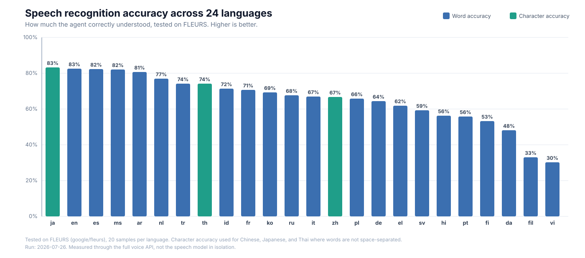

# Powering Genie with Open-Source Voice Models on Databricks

In a [previous post](https://medium.com/@suneel.sunkara/why-is-it-hard-to-build-voice-models-for-asian-languages-f2b5693492fe) we explored why building voice models for Asian languages is hard — the tonal systems, the script diversity, the lack of training data. This post is about what we did next: we took open-source models that handle those languages and wired them into [Databricks Genie](https://docs.databricks.com/en/generative-ai/genie.html), so a customer can call in their own language and get a grounded answer from [Unity Catalog](https://docs.databricks.com/en/data-governance/unity-catalog/index.html) data, spoken back to them.

Two developments changed that. First, open-source speech models now cover broad language sets in a single checkpoint — [Qwen3-ASR](https://huggingface.co/Qwen/Qwen3-ASR-1.7B) recognizes ~30 languages and [VoxCPM2](https://huggingface.co/openbmb/VoxCPM2) synthesizes ~30 — removing the need for a separate commercial service per language. Second, **the entire voice stack runs on Databricks**: the reasoning model ([Qwen3-Next](https://huggingface.co/Qwen/Qwen3-Next-80B-A3B-Instruct)) is available as a managed [Foundation Model API](https://docs.databricks.com/en/machine-learning/foundation-models/index.html) endpoint, and we deployed the two speech models ourselves on [GPU Model Serving](https://docs.databricks.com/en/machine-learning/model-serving/deploy-custom-model.html). Everything sits next to Genie and the governed data, not in a third-party cloud.

What that looks like in practice: a caller phones in and speaks Thai. The agent transcribes the request, looks up the account, offers to waive a late fee, applies the waiver once the customer agrees, and answers a follow-up analytical question by querying Genie — all spoken back in Thai. No language selection menu. No handoff to a different service.

This post walks through how we assembled these models into a live conversation, how we deployed them on Databricks, and what we measured. The models are used as released — no fine-tuning.

## Key Highlights

1. [Qwen3-ASR](https://huggingface.co/Qwen/Qwen3-ASR-1.7B) recognizes speech in ~30 languages with automatic language detection; [VoxCPM2](https://huggingface.co/openbmb/VoxCPM2) synthesizes the reply in the same language.
2. [Qwen3-Next](https://huggingface.co/Qwen/Qwen3-Next-80B-A3B-Instruct) reasons over the transcript, calls tools to act on the account, and queries [Databricks Genie](https://docs.databricks.com/en/generative-ai/genie.html) for grounded answers over governed data.
3. End-of-turn is detected semantically — [Silero VAD](https://github.com/snakers4/silero-vad) as a speech gate plus [smart-turn v3](https://huggingface.co/pipecat-ai/smart-turn-v3) as a completeness model — so the agent replies ~0.3s after the caller finishes, not on a fixed silence timer.
4. The conversation runs over a [WebSocket](https://developer.mozilla.org/en-US/docs/Web/API/WebSockets_API) API exposing three capabilities: speech-to-text, a full speech-to-speech agent loop, and text-to-speech.
5. The two speech models are packaged as [MLflow `ResponsesAgent`](https://docs.databricks.com/en/generative-ai/agent-framework/author-agent.html) endpoints, registered in [Unity Catalog](https://docs.databricks.com/en/data-governance/unity-catalog/index.html), and served on [GPU Model Serving](https://docs.databricks.com/en/machine-learning/model-serving/deploy-custom-model.html). The reasoning model is consumed as a managed [Foundation Model API](https://docs.databricks.com/en/machine-learning/foundation-models/index.html) endpoint.
6. Quality is measured end-to-end on public multilingual datasets ([FLEURS](https://huggingface.co/datasets/google/fleurs), [2M-Belebele](https://aclanthology.org/2025.findings-acl.569/), [CCFQA](https://arxiv.org/abs/2508.07295)) against baselines like [Whisper large-v3](https://huggingface.co/openai/whisper-large-v3).

## Why Genie Needs a Voice

[Genie](https://docs.databricks.com/en/generative-ai/genie.html) already reasons over governed data — it can answer "which accounts have overdue invoices above $5,000?" by querying [Unity Catalog](https://docs.databricks.com/en/data-governance/unity-catalog/index.html) tables directly. But today, a customer can only reach that reasoning through a typed question in a browser. On a live phone call, the conversation needs more:

- **Multilingual recognition** that preserves business entities — the invoice number, the dollar amount, the account name — in whatever language the caller speaks.
- **Grounded actions over real data.** Genie answers the analytical questions (e.g., "what's my outstanding balance?"). But the agent also needs to *act* — look up the account, waive a fee, confirm an action only once it actually succeeds — against governed operational data in [Lakebase](https://www.databricks.com/product/lakebase).
- **Sub-second turn-taking.** A browser query can take seconds. A voice call cannot — the customer is waiting in silence. Every component must be fast enough to sustain a natural conversation.
- **Self-governed infrastructure.** The enterprise must control the models and the data path — no audio leaving the platform, no third-party transcription service sitting between the customer and the governed tables.

## How a Live Conversation Works

Audio streams both ways over a [WebSocket](https://developer.mozilla.org/en-US/docs/Web/API/WebSockets_API), one turn at a time. Here's what happens in a single turn of the Thai billing call:

1. **The customer speaks — and the agent knows when they're done.** Their audio streams into the API, where a lightweight speech gate ([Silero VAD](https://github.com/snakers4/silero-vad)) confirms real speech and a semantic end-of-turn model ([smart-turn v3](https://huggingface.co/pipecat-ai/smart-turn-v3)) judges, at each pause, whether the sentence is actually complete. The turn finalizes about 0.3 seconds after the caller genuinely stops — not on a fixed timer — so the agent neither cuts them off mid-thought nor leaves them waiting.
2. **Qwen3-ASR recognizes the speech.** It detects that the language is Thai, transcribes the request, and returns the detected language tag so that every subsequent stage follows the caller's language. The invoice number is preserved.
3. **Qwen3-Next reasons and acts.** It interprets the transcript and calls the appropriate tool: an account lookup for balances and overdue invoices, a billing action to waive a fee once the customer agrees, or a Genie query when the question is analytical and requires reasoning over governed data. The model is instructed to act rather than narrate — it performs the action and states the result in a single turn.
4. **VoxCPM2 synthesizes the reply** in Thai, streaming the audio in short segments so playback begins before the sentence has finished generating. If the customer speaks over the reply, barge-in stops playback.

When the caller asks something the account lookup can't answer — "what's my average monthly spend this year?" — Qwen3-Next routes it to Genie, which queries the governed tables and returns a grounded answer. That answer gets spoken back in Thai.

## The Realtime API

The conversation isn't a single model call — it's a session over a WebSocket, with three API capabilities you can use independently or together:

- **`/v1/speech-to-text`** — stream audio in and receive the final transcript with the detected language.
- **`/v1/speech-llm-toolassist-speech`** — the complete agent loop: audio in, transcript, reasoning with tools, and synthesized speech out. This capability carries the conversation.
- **`/v1/text-to-speech`** — stream text in and receive synthesized speech out.

The loop is turn-based, not a continuous duplex stream. A [Databricks Model Serving](https://docs.databricks.com/en/machine-learning/model-serving/index.html) endpoint answers one request at a time and can stream its *output* back over [server-sent events](https://developer.mozilla.org/en-US/docs/Web/API/Server-sent_events) (SSE), but it does not hold an open bidirectional audio socket the way a dedicated real-time service like [Deepgram](https://deepgram.com) does.

What that means in practice: recognition is not word-by-word. Once end-of-turn is detected, the caller's full utterance is transcribed in a single request. The reply is generated in full, and only the synthesized audio streams back — in ~80ms segments over SSE — so playback begins before synthesis finishes. The API also supports barge-in (the caller can interrupt) and pre-generates a brief spoken acknowledgment so that slower, tool-heavy turns are covered by a response rather than silence.

"Real-time," here, means responsive turn-taking with low-latency streamed audio out — not incremental recognition or token streaming.

## Choosing the Models

We needed three models — recognition, reasoning, and synthesis — and picked each for a different reason.

**Recognition — [Qwen3-ASR-1.7B](https://huggingface.co/Qwen/Qwen3-ASR-1.7B).** The hardest stage: it has to get invoice numbers, amounts, and names right in a language nobody told it to expect. Qwen3-ASR covers ~30 languages in one checkpoint and auto-detects the spoken language, handing back the tag so the rest of the turn follows the caller. The obvious alternative — a commercial recognizer per language — means a new service and uneven coverage for every market. One model, one endpoint, same behavior everywhere.

**Synthesis — [VoxCPM2](https://huggingface.co/openbmb/VoxCPM2).** Speaks ~30 languages from a single model, clones a reference voice so the agent keeps one voice for the whole call, and streams audio in short segments so it starts talking almost immediately. One catch worth stating plainly: the languages the product *actually* supports are the intersection of what both models handle — a model card's language count is not a conversation.

**Reasoning — [Qwen3-Next-80B](https://huggingface.co/Qwen/Qwen3-Next-80B-A3B-Instruct).** Here latency and control outweighed raw quality. Across English, Thai, Indonesian, and Chinese it answered in ~1.17s at the median, with reliable tool-calling and the generation controls the pipeline needs; a stronger frontier model ([Claude Sonnet](https://www.anthropic.com/claude/sonnet)) was roughly twice as slow and rejected those controls. Tool-calling isn't optional — it's how the agent looks up accounts, applies billing actions, and reaches Genie.

## Serving on Databricks

All three models run on Databricks — but they got there two different ways. Use the managed path where it exists; deploy from open source where it doesn't.

**The managed path — Qwen3-Next.** It is available as a [Foundation Model API](https://docs.databricks.com/en/machine-learning/foundation-models/index.html) endpoint on Databricks, so we just point at it. Nothing to size, warm, or scale, and it's billed per request.

**The self-served path — Qwen3-ASR and VoxCPM2.** Neither has a managed option, so we deployed them ourselves with a repeatable pipeline that runs on serverless compute:

1. **Package.** Download the open-source checkpoint from [Hugging Face](https://huggingface.co) and wrap it in an [MLflow `ResponsesAgent`](https://docs.databricks.com/en/generative-ai/agent-framework/author-agent.html). MLflow infers the fixed `agent/v1/responses` signature, so Model Serving treats it as an agent endpoint: audio rides inside the request over the Responses `custom_inputs`/`custom_outputs` channel, and synthesis streams its segments back over SSE.
2. **Register.** Log the model into [Unity Catalog](https://docs.databricks.com/en/data-governance/unity-catalog/index.html) with pinned dependencies, then move a `candidate` alias onto the new version — so promoting a model is an alias flip, not a rebuild.
3. **Deploy.** Create, or update, a [GPU Model Serving](https://docs.databricks.com/en/machine-learning/model-serving/deploy-custom-model.html) endpoint pointed at the aliased version, on `GPU_MEDIUM` with scale-to-zero disabled.

One gotcha cost us real time: the GPU serving image ships a CUDA build the model wheels won't load against, so we pin the whole [PyTorch](https://pytorch.org) stack (`torch==2.7.1` on cu118, with a matching `torchvision`). Left unpinned, dependency resolution drifts to an incompatible wheel and inference fails at predict time with missing-operator errors — worth pinning from the start.

**Keeping the GPUs warm.** A fresh replica needs several inferences to reach steady-state latency, so scale-to-zero stays off and every endpoint is primed at startup. The first real customer turn lands fast, not slow.

**One governance model.** Whichever path a model takes, its endpoint is a Unity Catalog asset, so the voice layer inherits the same access control and lineage as [Genie](https://docs.databricks.com/en/generative-ai/genie.html) and the tables it reads. Nothing new to secure.

## Architecture at a Glance

The diagram shows the full data path. A browser streams audio over a [WebSocket](https://developer.mozilla.org/en-US/docs/Web/API/WebSockets_API) to a [FastAPI](https://fastapi.tiangolo.com) API. Inside each turn, the API drives the three models in sequence — transcribe, reason, synthesize — and streams audio back. The two speech models run on [GPU Model Serving](https://docs.databricks.com/en/machine-learning/model-serving/deploy-custom-model.html) (packaged as [MLflow `ResponsesAgent`](https://docs.databricks.com/en/generative-ai/agent-framework/author-agent.html)); the reasoning model is a managed [Foundation Model API](https://docs.databricks.com/en/machine-learning/foundation-models/index.html) endpoint. When Qwen3-Next needs to act, it calls tools against [Lakebase](https://www.databricks.com/product/lakebase) (account lookups, billing actions) or [Genie](https://docs.databricks.com/en/generative-ai/genie.html) (analytical questions). Account changes go through the governed billing tool — the model proposes, the tool executes.

## Benchmarks Across Languages

How well does the agent understand speech in each language? We tested on [FLEURS](https://huggingface.co/datasets/google/fleurs), a standard multilingual speech dataset, across all 24 supported languages. Each bar shows the percentage the agent got right — taller bars mean better understanding.

Japanese, English, Spanish, Malay, and Arabic lead at 81–83%. Thai, Indonesian, and Chinese — the languages that carry the live demo — all land above 67%, strong enough to hold a real billing conversation. The tail (Vietnamese, Filipino) is where the model needs improvement and represents future fine-tuning targets.

Every model update triggers a fresh benchmark run, and results land in a Delta table — so we always know where each language stands before promoting a version to production.

## Lessons Learned

**Detecting when the caller is actually done speaking was the hardest problem we solved.** On a phone call, people pause mid-sentence to think, take a breath, or look up a number. A simple silence timer can't tell the difference between a thinking pause and a finished sentence — it either cuts the caller off or leaves dead air while it waits for the timeout. We solved this with a two-stage pipeline that runs entirely on CPU ([`onnxruntime`](https://onnxruntime.ai), no GPU cost): first, [Silero VAD](https://github.com/snakers4/silero-vad) filters out background noise and confirms the caller is actually speaking; then [smart-turn v3](https://huggingface.co/pipecat-ai/smart-turn-v3) listens to the audio at every pause and decides whether the sentence is linguistically complete — does it end on a question, a statement, or is the caller still mid-thought? The result: turns finalize ~0.3 seconds after the caller genuinely stops. No premature cutoffs in our validation set. Languages that smart-turn doesn't cover fall back to a calibrated pause rule, and if the models fail to load the system degrades gracefully to energy-based detection.

**Perceived speed comes from the gaps between models, not from the models themselves.** We spent weeks optimizing model inference — and it barely moved the needle on how fast the conversation *felt*. What actually mattered was everything that happens in the transitions: how quickly we detect end-of-turn (above), how soon the first audio byte reaches the caller's speaker (streaming synthesis starts playing in ~80ms via [SSE](https://developer.mozilla.org/en-US/docs/Web/API/Server-sent_events) before the full sentence is generated), whether the caller hears silence or a brief spoken acknowledgment while the agent calls tools, and whether a cold [GPU endpoint](https://docs.databricks.com/en/machine-learning/model-serving/deploy-custom-model.html) is already warmed before the first real turn arrives. These systems-level choices — barge-in, endpoint priming, streamed first-byte — shaped the user experience more than any single model latency number.

## Future Direction

- **[Genie Agent Mode](https://www.databricks.com/blog/introducing-genie-agent-mode)** — today the reasoning stage queries Genie once per turn, like asking a single question. With Agent Mode, Genie can investigate like an analyst — planning, testing hypotheses, and iterating across multiple queries to answer complex follow-ups without leaving the call. That's the natural next step: the caller asks "why did our churn spike in Q3?" and Genie reasons through it live.
- **Telephony (8 kHz)** — the current path is built for wideband browser audio (16 kHz+). Narrowband telephone audio degrades recognition quality and needs dedicated handling via a [SIP](https://www.rfc-editor.org/rfc/rfc3261) gateway with acoustic echo cancellation.
- **Fine-tuning on domain audio** — the benchmark chart shows where the base model is weak. Targeted [LoRA](https://arxiv.org/abs/2106.09685) fine-tuning on enterprise call recordings for the tail languages is the next accuracy lever.

## Sources and Further Reading

**Open-source models**

- [Qwen3-ASR-1.7B](https://huggingface.co/Qwen/Qwen3-ASR-1.7B) — multilingual speech recognition with automatic language detection
- [VoxCPM2](https://huggingface.co/openbmb/VoxCPM2) — multilingual, voice-cloning speech synthesis
- [Qwen3-Next-80B-A3B-Instruct](https://huggingface.co/Qwen/Qwen3-Next-80B-A3B-Instruct) — reasoning and tool-calling
- [Silero VAD](https://github.com/snakers4/silero-vad) — streaming voice-activity detection (speech gate)
- [smart-turn v3](https://huggingface.co/pipecat-ai/smart-turn-v3) — audio-native semantic end-of-turn detection

**Benchmark datasets and baselines**

- [FLEURS](https://huggingface.co/datasets/google/fleurs) — multilingual read-speech recognition
- [2M-Belebele](https://aclanthology.org/2025.findings-acl.569/) — spoken reading-comprehension ([dataset](https://huggingface.co/datasets/facebook/2M-Belebele))
- [CCFQA](https://arxiv.org/abs/2508.07295) — spoken factual question answering ([dataset](https://huggingface.co/datasets/yxdu/ccfqa))
- [Whisper large-v3](https://huggingface.co/openai/whisper-large-v3) — recognition baseline
- [SeamlessM4T](https://huggingface.co/facebook/seamless-m4t-v2-large) — recognition baseline (cascaded with Llama-3-70B)

**Databricks**

- [AI/BI Genie](https://docs.databricks.com/en/generative-ai/genie.html)
- [Introducing Genie Agent Mode](https://www.databricks.com/blog/introducing-genie-agent-mode)
- [Agent Framework](https://docs.databricks.com/en/generative-ai/agent-framework/index.html)
- [Model Serving](https://docs.databricks.com/en/machine-learning/model-serving/index.html)
- [GPU Model Serving](https://docs.databricks.com/en/machine-learning/model-serving/deploy-custom-model.html)
- [Foundation Model APIs](https://docs.databricks.com/en/machine-learning/foundation-models/index.html)
- [Unity Catalog](https://docs.databricks.com/en/data-governance/unity-catalog/index.html)
- [Lakebase](https://www.databricks.com/product/lakebase) — low-latency operational store for account facts and billing writes

**Platform and tooling**

- [MLflow](https://mlflow.org) — model packaging and the `ResponsesAgent` contract
- [FastAPI](https://fastapi.tiangolo.com) — the realtime WebSocket API
- [PyTorch](https://pytorch.org) — speech-model runtime on the GPU endpoints
- [ONNX Runtime](https://onnxruntime.ai) — CPU inference for the endpointing models
- [Deepgram](https://deepgram.com) — dedicated real-time streaming speech API (referenced for contrast)
